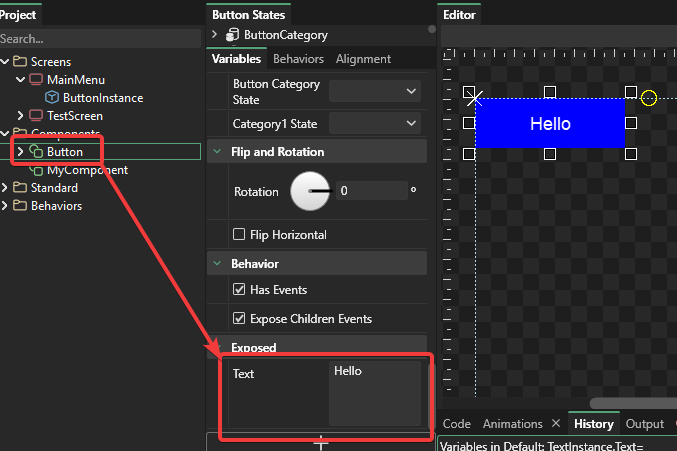

# 5 - Exposing Variables

## Introduction

The ability to expose variables in Gum makes components very powerful and flexible. For this example we will continue the Button example from the last tutorial.

## Recap

The last tutorial set up a Button component with Text and ColoredRectangle instances. The two were set up to be positioned correctly according to the size of the button.

We then created a MainMenu screen and added a few instances of the Button component to the MainMenu screen.

While the size and positioning functionality in our button works well, the Text itself always says "Hello".

## Exposing the Text variable

By default each instance of our Button cannot access values that are contained inside the ColoredRectangleInstance or TextInstance. However, we can "expose" these variables so that they can be modified in our MainMenu screen.

To do this:

1. Select TextInstance under Button
2. Find the "Text" variable in the Variables tab (Second column, under the "States" panel)
3. Right-click on the text box and select "Expose Variable"
4. Enter the name "Text" for the variable name

<figure><figcaption></figcaption></figure>

You can verify that the Text value is exposed by clicking the "Button" component and seeing the "Text" variable under the "Exposed" category:

<figure><figcaption></figcaption></figure>

## Setting instance variables

Now that the Text variable is an exposed variable, it can be set per-instance. To do this:

1. Select one of the Buttons in MainMenu
2. Change its Text to "Button 1"

Feel free to set different Text values on all of the buttons. Notice that the Text may word-wrap.

