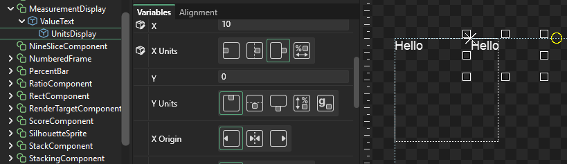
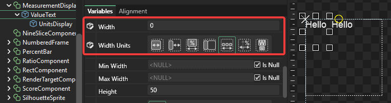
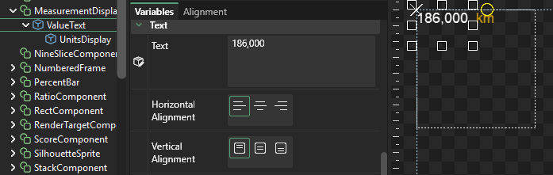

# 6 - Parent

## Introduction

The component tutorial shows how objects can be sized and positioned according to the container that they are a part of. Although this is the default behavior, the parent of an instance can be explicitly set to another instance.

This functionality is useful for

* Stacking objects on top of each other or side by side
* Placing objects next to other objects which are dynamically sized
* Creating tables and other complicated layout objects

## Creating a Component

For this example we'll create a Text object which includes a value and a unit of measurement. Specifically we'll create two text objects - one will display a numerical value, the other will say "feet". We will use two text objects so that we can independently color them.

To do this:

1. Create a new component called MeasurementDisplay
2. Drop two Text objects in the newly-created component
3. Name the first "ValueText" 
4. Name the second "UnitsDisplay"

## Positioning according to a parent

Next we'll make the UnitsDisplay use the ValueText as its parent:

1. Select the UnitsDisplay Text object
2. Change its Parent to ValueText
3. Change its X Units to "PixelsFromRight".  This will make the text object be positioned according to its parent's right edge
4. Change its X to 10 - this means the UnitsDisplay text will be 10 units offset from the right edge of its parent ValueText
5. Change its Y to 0

Next we'll want the parent text \(ValueText\) to automatically size according to its contents. To do this, set its Width to 0. Setting Width to 0 on a text instance means that the text's width will be equal to the size needed to display the text.

## Adjusting Colors

Now that we have the texts set up, let's modify the color of the UnitsDisplay:

1. Select the UnitsDisplay
2. Change Red to 200
3. Change Green to 150
4. Change Blue to 0

## Changing ValueText

Now the Text variable in ValueText can be changed, and when doing so the UnitsDisplay will automatically change positions:

