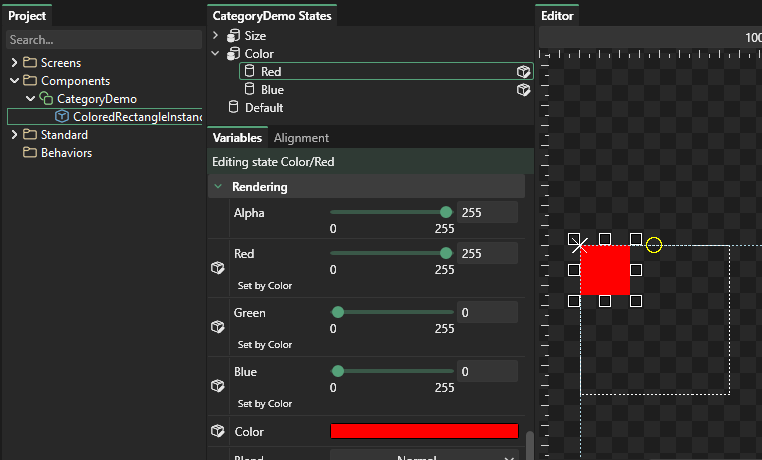
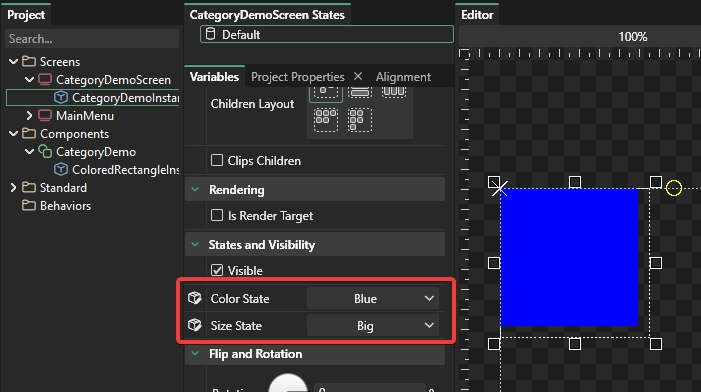

# 8 - State Categories

## Introduction

States are a powerful way to create expressive groups of variables. However, some UI elements may require a combination of states to be applied simultaneously.

For example, consider creating a CheckBox element. This CheckBox may have one set of states for whether it is checked:

* Checked
* Unchecked

But it may also need a second set of states for being enabled and disabled \(which may modify the color of the Text and graphics for the check box:

* Enabled
* Disabled

In this case the states may need to coexist. Categories allow you to organize states so that multiple states can be set simultaneously.

## Creating categorized states

For this tutorial we'll create a new component. This component will have state categories for size and for color. To do this:

1. Open Gum
2. Create a new Component called "CategoryDemo"
3. Right-click anywhere in the State box and select "Add Category" 
4. Enter the name "Size" for the new category and click OK 
5. Repeat the above steps to create a "Color" category

Now we can add states to the categories. To do this:

1. Right-click on the "Size" category and select "Add State"
2. Enter the name "Small" for the new state
3. Right-click on the "Size" category again and select "Add State"
4. Add a second state to "Big"
5. Right-click on the "Color" category and select "Add State
6. Add a state called "Red"
7. Right-click on the "Color" category again and select "Add State
8. Add a state called "Blue"

## Adding visuals

Now that we have states set up we need to add a visual element to the component so that we can see our changes.

To do this, drag+drop a ColoredRectangle into your component

## Setting variables in states

Just like with states which do not belong to categories, you can simply select a state and edit in the preview window or change properties in the Variables tab to modify what the state sets. Notice that normally for a component like this the ColoredRectangleInstance would have its width and height be relative to its container, but we're not doing this for the sake of keeping the tutorial shorter.

First we'll set the Size states. To do this:

1. Select the "Big" state
2. Resize the colored rectangle so it is larger than the default 
3. Select the "Small" state
4. Resize the colored rectangle so it is smaller than the default 

Next we'll set the Color states. To do this:

1. Select the "Red" state
2. Set the Red, Green, Blue values to:  255, 0, 0 
3. Select the "Blue" state
4. Set the Red, Green, Blue values to:  0, 0, 255 

## Viewing multiple states on an instance

Now that we have our CategoryDemo component set up with multiple categories, we can view these states on any CategoryDemo instance. To do this:

1. Create a Screen called CategoryDemoScreen
2. Drop an instance of the CategoryDemo component into the CategoryDemoScreen
3. Select the newly-created CategoryDemoInstance
4. Scroll down in the Variables list and notice that the instance has drop-downs for each category.  
5. You can set each state independently and the states will combine 

