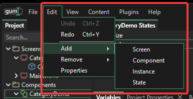
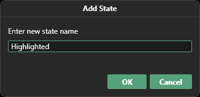
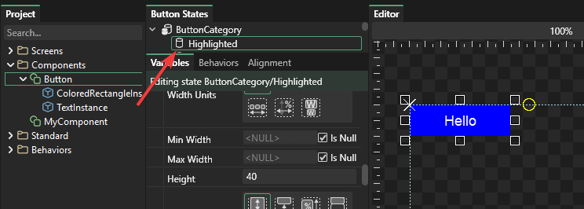
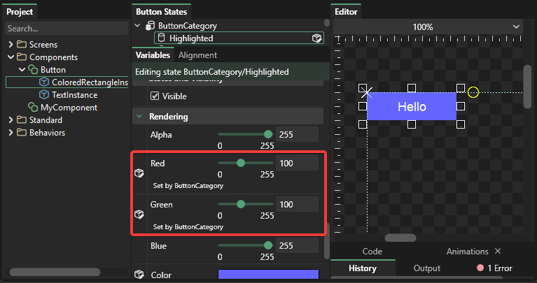

# Usage Guide \_ States

## Introduction

States allow you to set multiple variables at one time. Examples of states might include:

* A button with Regular, Highlighted, Pressed, and Disabled states
* A game logo in Large and Small modes
* A game where multiple options can be selected

## Prerequisites

This tutorial builds upon the previous tutorial where a Button component was created. To follow along you will need to have a Button component created as defined in the earlier tutorials.

## Defining states

First we'll define two new states. All components and screens have a "Default" state automatically. To add a new state:

1. Select Edit-&gt;Add State 
2. Enter the name "Highlighted"
3. Click OK 

The Button component will now have a new state called Highlighted: 

## Setting variables in states

Once a state is defined and selected, setting a variable will associate that variable with a given state. In other words, any variable that is set when the "Highlighted" state is selected will associate the variable with the Highlighted state.

For this example, we will make the button become a lighter blue when highlighted. To do this:

1. Verify the Highlighted state is selected
2. Select the ColoredRectangleInstance
3. Set the Green and Red values to 100

Notice that the Green and Red values are rendered in black rather than green - indicating that they are values that are explicitly set in the Highlight state.

## Switching between states

The values that have just been set apply **only** to the state that was selected - the Highlight state. This means that clicking on the Default state will switch the button back to the default colors. By clicking on the states in Gum you can preview and edit states easily.

## States override Default

Newly-created states will not automatically override all values on all objects - only values which are explicitly set on a given state. Therefore, any changes that are made in the Default state \(excluding the Red and Green values on the ColoredRectangleInstance\) will automatically apply to the Highlight state as well.

This is reflected through which values are drawn with black vs. green text in the UI.

