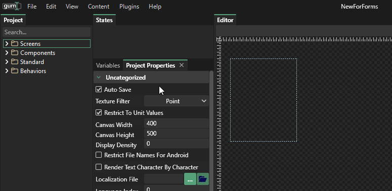

# Edit-\_Project Properties

## Introduction

The project properties window allows you to modify properties that apply across the entire project \(as opposed to a single screen or component\).

## Canvas Width/Height

Gum allows you to change the canvas width and height of a project. This canvas width/height can both give you a sense of size when creating UIs, as well as provide a container for objects with no parents. In other words, objects that sit directly in a screen \(as opposed to in another container\) will be positioned and sized according to the canvas width/height.

The canvas width and height can be changed through the project properties page:

