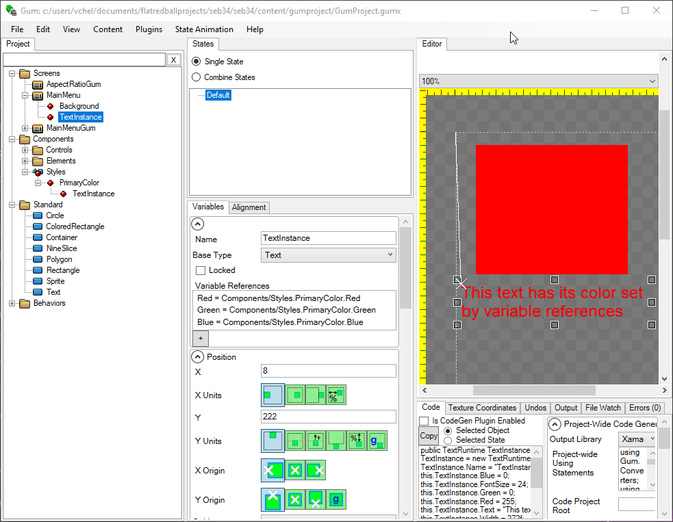

# Variable References

### Introduction

**Variable References** allows any variable on an instance to reference a variable on another instance. The most common use of **Variable References** is to create a centralized style component which can be referenced throughout a Gum project.

Variables which are assigned through **Variable References** cannot be directly set on the instance - the value obtained through the reference overwrites any custom value.

### Example - Creating Color Styles

The following example creates a Styles component which contains a color value which is referenced by objects in a MainMenu Screen.

Any component can serve as a centralized location for styling, but we use the name **Styles** by convention.

The Styles component can contain as many objects as are needed to style your project. Additional objects can be added to help indicate how things are used visually. For example, we include a Text object to indicate the red color is the **Primary Color**.

<figure><figcaption></figcaption></figure>

The color value can be referenced by any other object including objects in different screens or components.

To add a variable reference:

1. Select the object which should have a variable reference
2. Click inside the **Variable References** text box
3. Type the variable reference. The format of the variable reference is \
   \
   `{VariableName} = {Components or Screens}/{ComponentOrScreenName}.{InstanceName}.{InstanceVariable}`\
   \
   For example, to reference the Red variable in the Styles component, the syntax is\
   \
   `Red = Components/Styles.PrimaryColor.Red`\


Since color values have three components (Red, Green, and Blue), then all three components must be referenced. In this example, the background can reference the three colors with the following assignment text:

```
Red = Components/Styles.PrimaryColor.Red
Green = Components/Styles.PrimaryColor.Green
Blue = Components/Styles.PrimaryColor.Blue
```

<figure><figcaption></figcaption></figure>

The types of the objects that contain the **Variable References** or which are being referenced do not matter. For example, a Text object could have its color values depend on the color values defined by a ColoredRectangle in the Styles component.

<figure><figcaption></figcaption></figure>

Once Variable References are set, the referenced instances (instances in Styles) can be changed and the changes will immediately propagate throughout the entire project.

<figure><figcaption></figcaption></figure>

### Variable References in the Property Grid

As shown above, Variable References can be used to assign one variable to another. If a variable is referenced, then the variable cannot be manually assigned. The Variable Reference takes priority. For example, if an object references the Red, Green, and Blue variables, then those values cannot be manually set on the object. The values appear disabled and text indicates why they are read-only.

<figure><figcaption></figcaption></figure>

### Implied Variable References

When entering a variable reference, Gum understands implied variable references by filling in the left-side of the equals sign to match the variable name on the right-side. For example, the following can be entered in the Variable References text box:

```
Components/Styles.PrimaryColor.Red
```

Gum automatically adds `Red =` before the entry, as this is the most likely variable assignment. This addition happens when the text box loses focus, such as when Tab is pressed or when a different text box gains focus.

<figure><figcaption></figcaption></figure>

Assigning color values is a common part of styling, so to help with this situation, Gum also expands the "Color" variable into all three components when the Variable References text box loses focus. For example, the following text can be used to assign all three values at once:

```
Components/Styles.PrimaryColor.Color
```

When the Variable References box loses focus, this is expanded to the following assignments:

```
Red = Components/Styles.PrimaryColor.Red
Green = Components/Styles.PrimaryColor.Green
Blue = Components/Styles.PrimaryColor.Blue
```

<figure><figcaption></figcaption></figure>

### Same-Screen/Component References

The examples given above are useful for a centralized styling scenario. Variable references do not require referencing variables from other Screens or Components. If a reference is between two instances in the same Screen or Component, then the variable reference does not need to include the name of the component.&#x20;

For example, we can assign the X value of one ColoredRectangle (RedRectangle) to the X value of another ColoredRectangle (BlueRectangle) using the following assignment:

```
X = BlueRectangle.X
```

This assignment forces the RedRectangle's X value to match the BlueRectangle's X value.

<figure><figcaption></figcaption></figure>

Changing the BlueRectangle's X value automatically updates the RedRectangle's X, even though the two rectangles have no other relationship to each other (such as a parent-child relationship).

<figure><figcaption></figcaption></figure>

### Obtaining a Qualified Variable Name

Typing a variable name can be tedious, especially when referencing a variable in a different Screen or Component. Qualified variable names can be obtained by right-clicking on the variable name in Gum and selecting the **Copy Qualified Variable Name** option. This can then be pasted in the Variable References box of any other object.

<figure><figcaption></figcaption></figure>

### Referencing Different Variables

Usually a variable references the same-named variable from the source, such as Red being assigned to Red. This is not a requirement, and variables can reference other variable values. For example, the Green value could reference the Red value on a source.

```
Green = Components/Styles.PrimaryColor.Red
```

Although this is not common, referencing different variables can help create complex UI elements.

###

