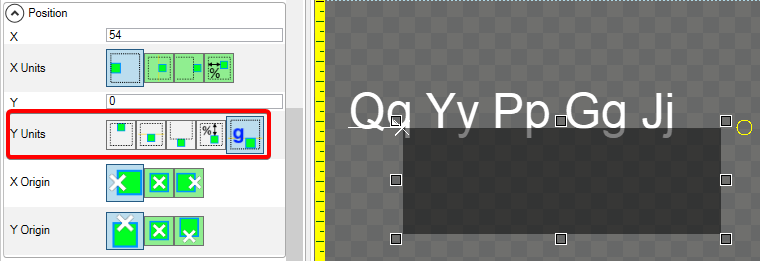

# Y Units

The **Y Units** variable controls how a unit is vertically positioned relative to its parent. By default an object is positioned relative to the top of its parent, where each unit represents 1 pixel downward.

## Pixels From Top

The following image shows a child [ColoredRectangle](../coloredrectangle.md) positioned 50 **Pixels From Top** relative to its parent:

## Pixels From Center

The following image shows a child ColoredRectangle positioned 50 **Pixels From Center** relative to its parent:

## Pixels From Bottom

The following image shows a child ColoredRectangle positioned 50 **Pixels From Bottom** relative to its parent:

## Percentage Parent Height

The following image shows a child ColoredRectangle positioned 50 **Percentage Parent Height** relative to its parent:

### Pixels From Baseline

Pixels From Baseline positions a child relative to the parent's baseline. If the parent is a Text instance, the baseline is the Y position of the bottom of letters which do not have descenders. For more information on the concept of text baseline, see the baseline Wikipedia page  [https://en.wikipedia.org/wiki/Baseline\_(typography)](https://en.wikipedia.org/wiki/Baseline_\(typography\))

The following image shows a child ColoredRectangle positioned 0 pixels relative to a Text instance's baseline. Note that the ColoredRectangle has an Alpha value of 128 so that the descenders from the Text instance are visible.

<figure><figcaption>
ColoredRectangle with Y Units of Pixels From Baseline
</figcaption></figure>

Note that if the parent is not a Text instance, then the bottom of the parent is used as the baseline. The following image shows a Colored Rectangle using a Y Units of Pixels From Baseline with a Container parent.

<figure><figcaption>
Pixels from Baseline uses the bottom of the parent if it is not a Text instance
</figcaption></figure>

