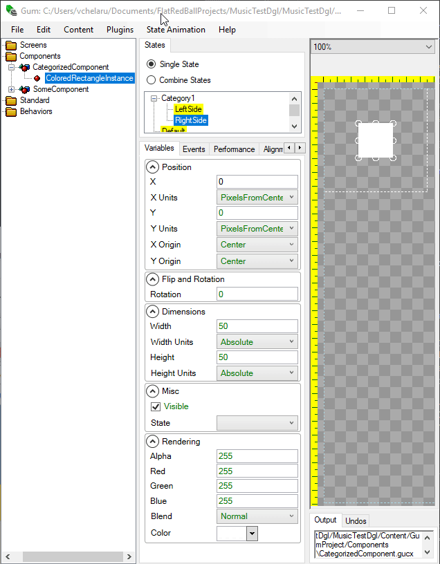
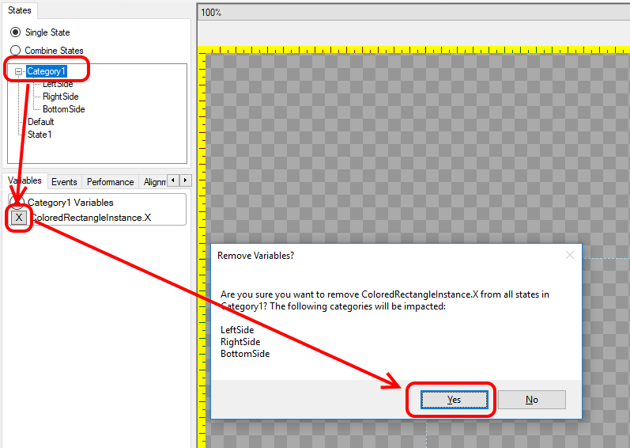

# Categories

## Introduction

Categories can be used to organize similar states into one group (such as a button's Pressed and Unpressed states).

A category can contain one or more states. States within a category have special behavior:

1. If one state in a category explicitly sets a variable (such as X), then all other states in that category will also explicitly set the variable.
2. Each category can be set individually on an instance of a component or standard element. In other words, if a component has two categories, each category can be assigned to a state within that category independently.

## Explicit Values Across States in a Category

Normally, when a new state is created, all variables are explicitly unset. The value displayed in the properties window will be the value inherited from the default state.

For example, the following image shows a component with a state called **State1** with no variables explicitly assigned. Notice all values are green:

We can see the same behavior on a categorized state. The following image shows the categorized **LeftSide** state with all inherited values:

As mentioned in the introduction, if a variable is explicitly set on one state in a category, then all other states in that category will that same variable set to its default.

For example, if we set the **X** variable in the **LeftSide** state, the **X** variable in the **RightSide** state will become explicitly set (black instead of green).

.gif>)

Once the **X** variable is set on one state in a category, all other states in the same category will automatically have this value set - even new states:

## Removing Variables from Categories

Variables can be removed from states, but this removal must be done at the category level rather than at the individual state. Doing so will remove all variables from all states within a category. To remove a variable in all states in a category:

1. Select the category itself (not the state)
2. Click the "X" button next to the variable
3. Confirm that you would like to remove the variable. Warning: this will remove the variable from all contained states.

This will remove the assignment of the variable from all states in the category.
