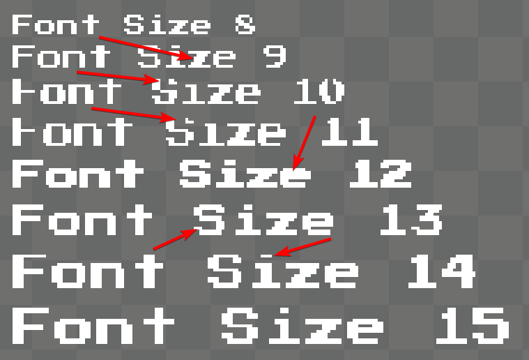

# Font Size

### Introduction

Font Size controls how large a font appears on screen. Each font size and Font combination creates its own rasterized font, so using a lot of different font sizes will increase the amount of texture memory your game needs.

### Example

The Font Size property can be set in Gum to make a text object's font larger or smaller. For example, the following shows a Text object with a font size of 18:

.png>)

Changing the font size will increase the size of the Text object. For example, here is the same Text object with a Font Size of 36:

.png>)

### Font Cache

The first time a Font and Font Size combination are referenced, Gum creates a file in the FontCache folder. You may notice a small pause in Gum when setting Font and Font Size combinations for the first time as the file is created, but subsequent changes will be fast.

The FontCache folder is located in the following location:

/FontCache/

.png>)

### Font Size and Pixel Fonts

Games which are using fonts that are intentionally pixelated should avoid setting Font Size in-between the intended font size multiples for the given font. These sizes depend on the specific font used, and may require some trial and error.

For example, consider the font Press Start 2P which can be installed from [https://fonts.google.com/specimen/Press+Start+2P](https://fonts.google.com/specimen/Press+Start+2P)

Font Size can be set to any value, but this font only looks good if Font Size is set to 8.

<figure><figcaption>
Font Size 8 through 15 with Press Start 2P Font
</figcaption></figure>

The rendering artifacts are more obvious when zooming in, as shown in the following image:

<figure><figcaption>
Rendering artifacts on font sizes which are not multiples of the intended font size for Press Start 2P font
</figcaption></figure>

Of course, we could also set the Font Size to 16, but this is unnecessary. Since text instances using pixelated fonts usually have [Use Font Smoothing](use-font-smoothing.md) set to false, then the Text can use its [Font Scale](font-scale.md) to adjust its size.
