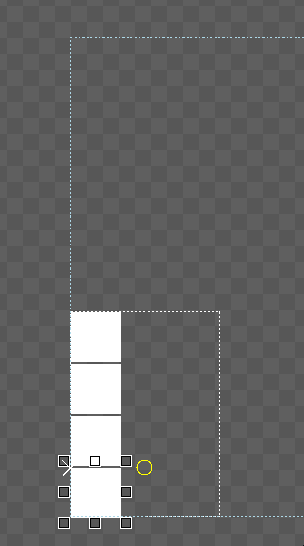

# Bottom-Up Stack

Bottom-up stacks can be used to display stacks of elements which should move up as more are added. This concept is similar to messages received in a chat window. Gum layout can be used to produce this type of stack.

A bottom-up stack will be a container, which could be an instance of a container or a component since components ultimately are containers. For this example we'll use a container.

<figure><figcaption>
Container instance
</figcaption></figure>

For this container to stack we'll set the following variables:

*   Children Layout set to Top to Bottom Stack so all children stack vertically\

    <figure><figcaption>
Children Layout set to Top to Bottom Stack
</figcaption></figure>
*   Height Units set to Relative to Children so the container resizes itself as more children are added\

    <figure><figcaption>
Height Units set to 
</figcaption></figure>
*   Height set to 0 so the height of the container is based purely on its children\

    <figure><figcaption>
Height set to 0
</figcaption></figure>
*   Stack Spacing set to 2 (optional) to add spacing between each child\
    \

    <figure><figcaption>
Stack Spacing set to 2
</figcaption></figure>

Now the container can have children added. Any type of child will stack. For this tutorial we'll use ColoredRectangle instances. Add a few instances to the Container and they stack vertically.

<figure><figcaption>
ColoredRectangle instances stacking vertically in a container
</figcaption></figure>

Finally we can have the stack grow up instead of down.  To do this, change the following variables on the parent container:

*   Y Origin set to Bottom\

    <figure><figcaption>
Y Origin set to Bottom
</figcaption></figure>
*   Y Units set to Pixels from Bottom\

    <figure><figcaption>
Y Units set to Pixels from Bottom
</figcaption></figure>

Now as new children are added, the parent stack grows and all items shift up.

<figure><figcaption>
Stack grows upward as more children are added
</figcaption></figure>

