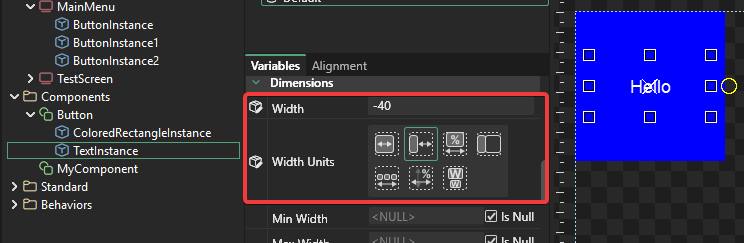

# 4 - Components

## Introduction

Components can contain instances of other components and of standard objects. Examples of components include:

* Check boxes
* Buttons
* Popup Menus

Components can also be simple (such as a button) or more complex UI elements such as a full Options screen with dozens of instances.

## Simple Button Example - Creating the Entity

To understand how components work, we'll create a simple Button component. To do this:

1. Right-click on the Components folder in Gum and select "Add Component"
2. Name the Component "Button"
3. Drag+drop a "ColoredRectangle" standard element into the Button component
4. Drag+drop a "Text" standard element into the Button component

Since both the ColoredRectangleInstance and TextInstance are using white text you may not be able to see the Text. Let's change the ColoredRectangleInstance's color:

1. Select the ColoredRectangleInstance
2. Change Red to 0
3. Change Green to 0
4. Set Blue to 255 - this should change the background from being green (default) to white (custom value). To do this, simply delete and re-type 255 in the Blue box, or click in the box and press enter.

Now you should be able to see the Text on top of the rectangle:

## Sizing the colored rectangle

At this point we have what will eventually become a button, but it still needs some work. First, we're going to adjust the size of the objects contained in the button. At this point you can see that the colored rectangle (the blue background for the button) is not the same size as the button. Not only do we want to make the blue colored rectangle larger, but we also want it to automatically match the Button's size (the dotted outline).

To do this:

1. Select the ColoredRectangleInstance
2. Select the Alignment tab
3. Click the Fill Dock button

<figure><figcaption>
Fill Dock expands the ColoredRectangleInstance to occupy its full parent
</figcaption></figure>

Alternatively you can adjust the individual values:

1. Select the ColoredRectangleInstance
2. Change Height Units to "Relative to Container"
3. Change the Width Units to "Relative to Container"
4. Change the Height to 0. This means that the Height of the ColoredRectangleInstance will match the Height of its container (the Button Component) since it's using "Relative to Container" Height Units.
5. Change the Width to 0. Just like with Height, this means that the Width of the ColoredRectangleInstance will match the Width of its container.

Now the ColoredRectangleInstance automatically matches the Button's Width and Height:

## Positioning the Text

Next we'll position the Text. We'll want to adjust the Text so that it is always centered, and line-wraps with the size of the button.&#x20;

To do this:

1. Select TextInstance
2. Click the Alignment tab
3. Set the Margin to 20
4. Click the Fill Dock button

<figure><figcaption></figcaption></figure>

Alternatively you can set each individual value on the Text by following these steps:

1. Select TextInstance
2. Change its HorizontalAlignment to Center
3. Change its VerticalAlignment to Center

At this point the Text is vertically and horizontally centered within its boundaries, but we want to have the boundaries centered within the Button. To do this:

1. Keep TextInstance selected
2. Change the X Units to "Pixels From Center"
3. Change the X Origin to "Center"
4. Change X to 0

Now let's make it centered on the Y as well:

1. Keep the TextInstance selected
2. Change the Y Units to "Pixels From Center"
3. Change the Y Origin to "Center"
4. Change Y to 0

.png>)

Finally, let's make the width of the text match the width of the button. For the Text we'll actually leave a border around the edge so the Text doesn't line wrap right against the edge of the button. To do this:

1. Keep the TextInstance selected
2. Change the Width Units to "Relative to Container"&#x20;
3. Change Width to -40. This means that the width of the Text will be 40 pixels less than the width of its container. Since the button is centered this means a 20 pixel border on the left and 20 on the right (20+20=40).

## Setting the Button default values

Buttons are typically wider than they are tall. To match this common layout, let's set the default values on the Button:

1. Select the Button component
2. Change Width to 120
3. Change Height to 36

Notice that whenever you change these values, the contained objects (text and colored rectangle) adjust automatically.

## Using components as instances

Now that we have a component created, we can add instances of this component the same way we have added standard elements. To do this:

1. Create a new Screen. I'll call mine MainMenu
2. Drag+drop the Button component into the Screen

You can now resize and position the Button instance. You can also add multiple buttons and adjust the individually.

See the section (Exposing Variables) to learn how to change the text independently for each button!

