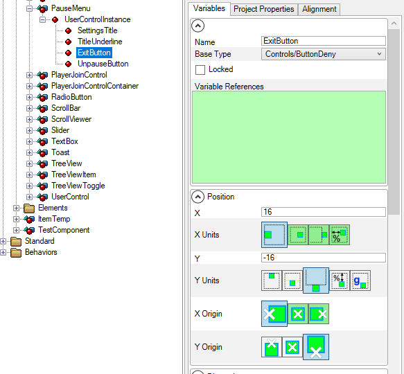
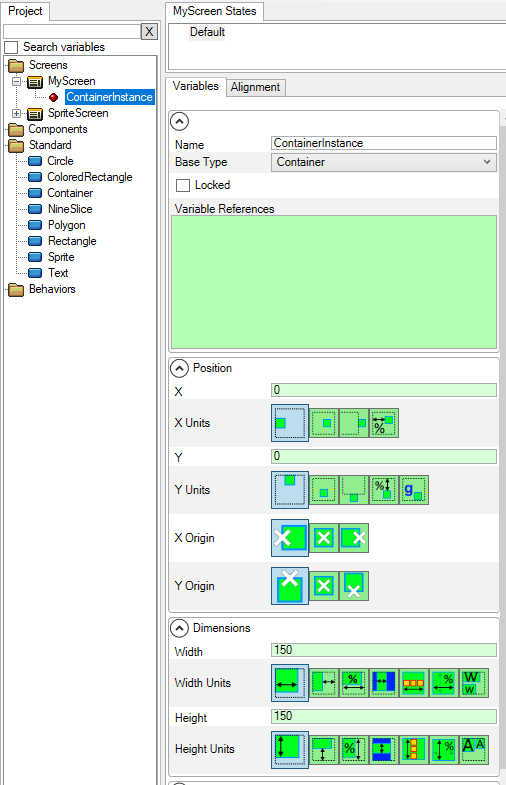

# Variables

## Introduction

The Variables tab displays the variables for the currently-selected element, instance, or behavior. The variables tab displays the effective value of all variables for the selected object and provides controls for changing these variables.

<figure><figcaption>
Variables for the ExitButton instance
</figcaption></figure>

## Default and Explicitly Set Values

Gum helps you visualize which variables are explicitly set at the current selection level. If a variable is not explicitly set, then it inherits the value from the next level down.

Standard elements explicitly set their values on their Default state, which means all values have a white background.

<figure><figcaption>
All values explicitly set on a a Colored Rectangle
</figcaption></figure>

By contrast, if a ColoredRectangle is dropped into a Screen or Component, most of its variables are not explicitly set so they show up with a green background.

<figure><figcaption>
Most variables are not explicitly set, so they have a green background
</figcaption></figure>

If a variable is set, then its value is updated and its background changes from green to white.

<figure><figcaption>
Setting values changes the background from green to white
</figcaption></figure>
