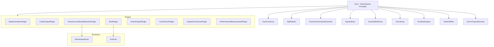

# Gum (Herramienta Principal)

## Descripción

Gum es un editor WYSIWYG (What You See Is What You Get) para diseñar interfaces de usuario de videojuegos. Permite a los desarrolladores crear layouts de UI visualmente sin escribir código, con soporte para pantallas, componentes, estados, animaciones y generación de código automático.

La herramienta genera archivos `.gumx` (proyecto), `.gusx` (pantallas), `.gucx` (componentes) que pueden ser renderizados en múltiples motores de juego (MonoGame, FNA, KNI, Raylib, SkiaSharp).

## Diagrama de Relaciones



## Tecnología

| Aspecto | Valor |
|---------|-------|
| **Framework** | WPF (Windows Presentation Foundation) + Windows Forms |
| **Gráficos** | KNI (nkast.Xna.Framework) + SkiaSharp |
| **MVVM** | CommunityToolkit.Mvvm |
| **DI** | Microsoft.Extensions.DependencyInjection |
| **Plugins** | MEF (System.ComponentModel.Composition) |
| **.NET** | net8.0-windows |
| **Lenguaje** | C# 12.0 |
| **Salida** | WinExe (Ejecutable Windows) |

## Punto de Entrada

| Archivo | Método | Ruta |
|---------|--------|------|
| `Program.cs` | `Program.Main(string[] args)` | `Gum/Program.cs` |
| `App.xaml.cs` | `App.OnStartup()` | `Gum/App.xaml.cs` |

### Secuencia de Inicio

1. **Program.Main()** → Crea el host de DI
2. **GumBuilder.CreateHostBuilder()** → Configura todos los servicios
3. **Locator.Register()** → Registra el service provider para acceso estático
4. **InitializeGum()** → Inicializa managers y plugins:
   - `ProjectManager.LoadSettings()`
   - `ThemingService.ApplyInitialTheme()`
   - `TypeManager.Initialize()`
   - `ElementTreeViewManager.Initialize()`
   - `WireframeObjectManager.Initialize()`
   - `PropertyGridManager.InitializeEarly()`
   - `PluginManager.Initialize()` → Carga plugins vía MEF
   - `StandardElementsManager.Initialize()`
   - `ProjectManager.Initialize()` → Carga último proyecto

## Funcionalidades Principales

- Editor visual de UI con preview en tiempo real
- Sistema de pantallas, componentes y elementos estándar
- Estados y categorías de estados para animaciones
- Sistema de instancias con herencia de componentes
- Sistema de behaviors reutilizables
- Generación de código C# automática
- Exportación a múltiples runtimes (MonoGame, FNA, KNI, SkiaSharp, Raylib)
- Sistema de plugins extensible
- Importación desde archivos .gumx externos
- Soporte para SVG, Lottie y gráficos vectoriales

## Clases Clave

| Clase | Responsabilidad |
|-------|-----------------|
| **ProjectManager** | Gestiona el proyecto actual, carga/guarda archivos, archivos recientes |
| **PluginManager** | Descubre y carga plugins vía MEF, enruta eventos a plugins |
| **ElementTreeViewManager** | Gestiona el árbol jerárquico de elementos en la UI |
| **StandardElementsManager** | Gestiona elementos estándar (Container, Text, Sprite, etc.) |
| **PropertyGridManager** | Gestiona la grilla de propiedades |
| **SelectedState** | Estado de selección actual (elemento, instancia, estado, variable) |
| **WireframeObjectManager** | Renderiza el preview visual |
| **UndoManager** | Sistema de deshacer/rehacer |

### Servicios DI (Dependency Injection)

| Interfaz | Implementación | Responsabilidad |
|----------|---------------|-----------------|
| `IProjectManager` | ProjectManager | Ciclo de vida del proyecto |
| `IProjectState` | ProjectState | Estado del proyecto |
| `ISelectedState` | SelectedState | Estado de selección |
| `IWireframeObjectManager` | WireframeObjectManager | Renderizado preview |
| `IDialogService` | DialogService | Diálogos |
| `IThemingService` | ThemingService | Temas visuales |
| `IHotkeyManager` | HotkeyManager | Atajos de teclado |
| `IUndoManager` | UndoManager | Deshacer/rehacer |
| `IFileWatchManager` | FileWatchManager | Detección de cambios en archivos |

## Cómo Ampliar

### 1. Crear un Nuevo Plugin

**Plugin Interno** (compilado dentro de Gum.exe):
```csharp
[Export(typeof(PluginBase))]
internal class MiPlugin : PriorityPlugin
{
    public override void StartUp()
    {
        // Suscribirse a eventos
        this.ElementSelected += HandleElementSelected;
        this.VariableSet += HandleVariableSet;
    }
    
    public override bool ShutDown(PluginShutDownReason reason) => false;
}
```

**Plugin Externo** (DLL en carpeta Plugins):
```csharp
[Export(typeof(PluginBase))]
public class MiPlugin : PluginBase
{
    public override string FriendlyName => "Mi Plugin";
    public override string UniqueId => "mi-plugin-id";
    public override Version Version => new Version(1, 0);
    
    public override void StartUp() { /* ... */ }
    public override bool ShutDown(PluginShutDownReason reason) => false;
}
```

### 2. Eventos Disponibles para Plugins

| Categoría | Eventos |
|-----------|---------|
| **Proyecto** | `ProjectLoad`, `AfterProjectSave`, `BeforeProjectSave` |
| **Elemento** | `ElementAdd`, `ElementDelete`, `ElementDuplicate`, `ElementRename`, `ElementSelected` |
| **Instancia** | `InstanceAdd`, `InstanceDelete`, `InstanceRename`, `InstanceReordered`, `InstanceSelected` |
| **Estado** | `StateAdd`, `StateDelete`, `StateRename`, `ReactToStateSaveSelected` |
| **Variable** | `VariableAdd`, `VariableDelete`, `VariableSet`, `VariableSelected`, `VariableExcluded` |
| **Wireframe** | `WireframeRefreshed`, `CameraChanged`, `BeforeRender`, `AfterRender` |

### 3. Añadir Items de Menú

```csharp
var menuItem = AddMenuItem("Tools", "Mi Feature");
menuItem.Click += (s, e) => { /* handler */ };
```

### 4. Crear Tabs de Plugin

```csharp
var tab = CreateTab(myControl, "Mi Tab", TabLocation.RightBottom);
tab.Show();
```

## Retos al Ampliar

### Complejidad del Estado Global
- **SelectedState** es un singleton mutable compartido por TODO el sistema
- Cambios en la selección Disparan cascadas de eventos
- **Recomendación**: Suscribirse a cambios vía MVVM Messenger en lugar de referencias directas

### Sistema de Plugins MEF
- Los plugins se cargan dinámicamente y pueden tener estados conflictivos
- El orden de carga no está garantizado
- **Recomendación**: Usar `Lazy<T>` para dependencias entre plugins

### Renderizado Multiplataforma
- El wireframe usa KNI (XNA-compatible) pero plugins pueden usar SkiaSharp
- Coordinar sistemas de coordenadas entre WPF y XNA
- **Recomendación**: Usar `IRenderableIpso` para abstraer el renderizado

### Sistema de Deshacer (Undo)
- Es endémico (cada operación debe registrar su undo manualmente)
- No hay transacciones atómicas automáticas
- **Recomendación**: Envolver operaciones complejas en `UndoManager.Transaction`

### Thread Safety
- WPF requiere operaciones UI en el thread principal
- Plugins pueden intentar operaciones desde backgrounds threads
- **Recomendación**: Usar `Dispatcher.Invoke()` para operaciones UI