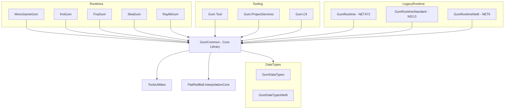

# GumCommon (Librería Core Compartida)

## Descripción

GumCommon es una librería portátil y agnóstica de plataforma que contiene los tipos de datos y lógica de runtime compartidos entre todos los runtimes de Gum (MonoGame, KNI, FNA, SkiaSharp, Raylib). Proporciona la base común para que el editor Gum y los motores de juego puedan trabajar con los mismos objetos de UI.

Esta librería no tiene dependencias de gráficos específicos, permitiendo que el mismo código funcione en cualquier motor de juego.

## Diagrama de Relaciones



## Tecnología

| Aspecto | Valor |
|---------|-------|
| **Framework** | .NET 8.0 (sin dependencias gráficas) |
| **Lenguaje** | C# 12.0 |
| **Tipo** | Class Library |
| **Package** | NuGet: FlatRedBall.GumCommon |
| **Licencia** | MIT |

## Punto de Entrada

Al ser una librería, no tiene punto de entrada ejecutable. Las clases principales son:

| Clase | Uso Principal |
|-------|---------------|
| `GraphicalUiElement` | Clase base para todos los elementos UI |
| `AnimationController` | Controla animaciones state-based |
| `AnimationRuntime` | Representa una animación con keyframes |
| `LocalizationService` | Servicio de localización multiidioma |

## Funcionalidades Principales

- **GraphicalUiElement**: Clase base para todos los elementos UI con sistema de layout
- **Sistema de animaciones**: Animaciones basadas en estados con interpolación
- **Localización**: Servicio de traducción con soporte para CSV y RESX
- **Colecciones observables**: Colecciones sincronizadas bidireccionalmente
- **Interfaces de renderizado abstraídas**: `IRenderable`, `IRenderer`, `IText`, etc.

## Clases Clave

### Animación (Gum.StateAnimation.Runtime)

| Clase | Responsabilidad |
|-------|-----------------|
| `AnimationController` | Controla playback (Play/Pause/Stop), timing, eventos |
| `AnimationRuntime` | Animación completa con keyframes, interpolación y loop |
| `KeyframeRuntime` | Keyframe individual con estado, tiempo y easing |

### Localización (Gum.Localization)

| Clase | Responsabilidad |
|-------|-----------------|
| `ILocalizationService` | Interfaz para localización |
| `LocalizationService` | Implementación con base de datos por idioma |
| `LocalizationServiceExtensions` | Carga desde CSV y RESX |

### Colecciones (Gum.Collections)

| Clase | Responsabilidad |
|-------|-----------------|
| `GraphicalUiElementCollection` | Wrapper ObservableCollection sincronizado bidireccionalmente |

### Interfaces de Renderizado

| Interfaz | Propósito |
|----------|-----------|
| `IRenderable` | Contrato de renderizado |
| `IRenderableIpso` | Elemento posicionable y renderizable |
| `IRenderer` | Renderer específico de plataforma |
| `ISystemManagers` | Servicios del sistema |
| `IText` | Renderizado de texto |
| `IContentLoader` | Carga de assets |

## Cómo Ampliar

### 1. Crear un Nuevo Runtime

```csharp
// 1. Referenciar GumCommon
// 2. Implementar interfaces de renderizado

public class MySystemManagers : ISystemManagers
{
    public IRenderer Renderer { get; }
    // ... implementar otras propiedades
}

public class MyRenderer : IRenderer
{
    public void Render(IRenderable renderable) { /* ... */ }
}

// 3. Implementar GraphicalUiElement wrapper
public class MySprite : GraphicalUiElement
{
    private MyRenderableSprite _visual;
    
    protected override void OnParentChanged(GraphicalUiElement oldParent, GraphicalUiElement newParent)
    {
        // Actualizar jerarquía visual
    }
}
```

### 2. Añadir Nuevos Tipos de Interpolación

```csharp
// Los tipos de interpolación se definen en FlatRedBall.InterpolationCore
// Registrar función de interpolación:
Tweener.GetInterpolationFunction = (type) =>
{
    if (type == InterpolationType.MyCustomEase)
        return MyCustomEasingFunction;
    return DefaultInterpolation(type);
};
```

### 3. Extender Localización

```csharp
// Añadir nuevo formato de base de datos:
public static class LocalizationExtensions
{
    public static void AddJsonDatabase(this ILocalizationService service, string path)
    {
        var data = File.ReadAllText(path);
        var entries = JsonSerializer.Deserialize<Dictionary<string, string>>(data);
        service.AddDatabase(entries);
    }
}
```

## Retos al Ampliar

### Patrón de Archivos Compartidos
- Los archivos fuente se compartan vía `<Compile Include="..\OtherProject\*.cs" Link="..."/>`
- Cambios en archivos fuente afectan múltiples proyectos
- **Recomendación**: Ejecutar todos los tests después de cambios

### GraphicalUiElement Gigante
- La clase principal tiene~6955 líneas
- Lógica de layout, estados, binding, jerarquía todo mezclado
- **Recomendación**: Crear partial classes para分离- functionality

### Multi-targeting
- GumCommon compila para net8.0
- Otros runtimes necesitan versiones legacy (net472, netstandard2.0)
- **Recomendación**: Usar shared projects (.shproj) para código común

### Dependencia de FlatRedBall.InterpolationCore
- Animaciones dependen de librería externa
- Cambios en InterpolationCore pueden romper compatibilidad
- **Recomendación**: Versionar cuidadosamente las dependencias NuGet