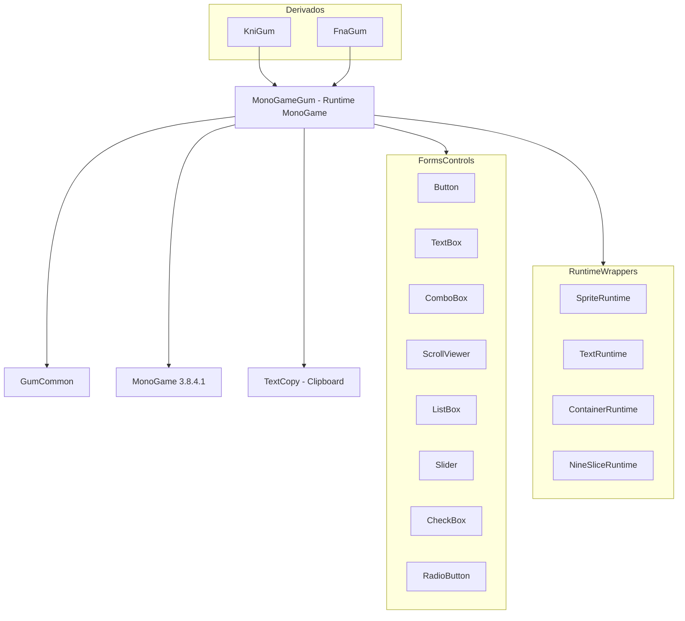

# MonoGameGum (Runtime MonoGame)

## Descripción

MonoGameGum es el runtime principal de Gum para el framework MonoGame. Proporciona renderizado de UI, sistema de controles (Forms), manejo de input y animaciones para juegos desarrollados con MonoGame.

Este runtime permite usar elementos de UI creados en la herramienta Gum editor directamente en juegos MonoGame.

## Diagrama de Relaciones



## Tecnología

| Aspecto | Valor |
|---------|-------|
| **Framework** | MonoGame Framework 3.8.4.1 |
| **.NET** | net8.0; net9.0-ios (multi-targeting) |
| **Lenguaje** | C# 12.0 |
| **Package** | NuGet: Gum.MonoGame |
| **Define Constants** | MONOGAME |

## Punto de Entrada

| Clase | Método | Uso |
|-------|--------|-----|
| `GumService` | `Initialize(game)` | Inicializa Gum con el juego MonoGame |
| `GumService` | `Update()` | Actualiza lógica (llamar en Game.Update) |
| `GumService` | `Draw()` | Renderiza UI (llamar en Game.Draw) |

```csharp
// Ejemplo de inicialización
public class MyGame : Game
{
    protected override void Initialize()
    {
        GumService.DefaultInitialize(this);
        base.Initialize();
    }
    
    protected override void Update(GameTime gameTime)
    {
        GumService.DefaultUpdate(gameTime);
        base.Update(gameTime);
    }
    
    protected override void Draw(GameTime gameTime)
    {
        GumService.DefaultDraw(gameTime);
        base.Draw(gameTime);
    }
}
```

## Funcionalidades Principales

- Renderizado de UI con MonoGame (sprites, texto, nine-slice, etc.)
- Sistema Forms completo (botones, cajas de texto, listas, etc.)
- Manejo de input (mouse, keyboard, gamepad, touch)
- Sistema de animaciones con keyframes
- Hot reload para desarrollo
- Bindings MVVM
- Soporte para iOS

## Clases Clave

### Servicio Principal

| Clase | Responsabilidad |
|-------|-----------------|
| `GumService` | Singleton principal - inicialización, update, draw |
| `FormsUtilities` | Helpers estáticos para Forms |

### Runtime Wrappers

| Clase | Propósito |
|-------|-----------|
| `SpriteRuntime` | Wrapper de GraphicalUiElement para sprites |
| `TextRuntime` | Wrapper para texto |
| `ContainerRuntime` | Wrapper para containers |
| `NineSliceRuntime` | Wrapper para nine-slice |
| `ColoredRectangleRuntime` | Wrapper para rectángulos coloreados |

### Forms Controls

| Clase | Propósito |
|-------|-----------|
| `Button` | Botón con estados (Normal, Hover, Pushed) |
| `TextBox` | Campo de entrada de texto |
| `ComboBox` | Dropdown con selección |
| `ListBox` | Lista scrollable |
| `ScrollViewer` | Container con scroll |
| `Slider` | Control deslizante |
| `CheckBox` | Checkbox con estado |
| `RadioButton` | Radio button |

### Input

| Clase | Propósito |
|-------|-----------|
| `Cursor` | Manejo de mouse/touch |
| `Keyboard` | Manejo de teclado |

## Cómo Ampliar

### 1.Crear un Control Custom

```csharp
public class MyCustomButton : InteractiveGue
{
    private SpriteRuntime _background;
    private TextRuntime _label;
    
    public MyCustomButton() : base(new ContainerRuntime())
    {
        _background = new SpriteRuntime();
        _label = new TextRuntime();
        
        this.AddChild(_background);
        this.AddChild(_label);
        
        // Configurar estados
        this.RollOn += (s, e) => { _background.Color = Color.Gray; };
        this.RollOff += (s, e) => { _background.Color = Color.White; };
        this.Push += (s, e) => { _background.Color = Color.DarkGray; };
        this.Click += (s, e) => { /* lógica de click */ };
    }
}
```

### 2. Añadir Nuevo Elemento Runtime

```csharp
public class MyParticleRuntime : GraphicalUiElement
{
    private ParticleSystem _particleSystem;
    
    protected override void OnVisibleChanged()
    {
        base.OnVisibleChanged();
        if (_particleSystem != null)
            _particleSystem.IsActive = this.Visible;
    }
    
    public override void UpdateLayout()
    {
        base.UpdateLayout();
        _particleSystem?.Update();
    }
}
```

### 3. Custom Content Loader

```csharp
public class MyContentLoader : IContentLoader
{
    public object Load(string contentName)
    {
        // Cargar contenido desde ubicación custom
        return MyContentManager.Load<Texture2D>(contentName);
    }
}

// Registrar
GumService.ContentLoader = new MyContentLoader();
```

## Retos al Ampliar

### Multi-Plataforma
- net8.0 para DesktopGL, net9.0-ios para iOS
- TextCopy no funciona en iOS (clipboard limitado)
- **Recomendación**: Usar `#if !IOS` para clipboard

### Ciclo de Vida de Contenido
- MonoGame usa ContentManager, Gum necesita gestión separada
- Hot reload puede causarmemory leaks
- **Recomendación**: Implementar IDisposable en controles custom

### Coordenadas entre Sistemas
- Gum usa sistema de coordenadas propio
- MonoGame usa sistema diferente ( origen top-left)
- **Recomendación**: Usar `GetAbsoluteX()`/`GetAbsoluteY()` para conversión

### Performance
- Cada GraphicalUiElement tiene overhead
- UI compleja puede afectar FPS
- **Recomendación**: Usar `Visible = false` para elementos fuera de pantalla

### Dependencia de MonoGame Versión
- Diferentes versiones de MonoGame tienen APIs distintas
- MonoGame 3.8+ tiene cambios breaking
- **Recomendación**: Versionar explícitamente la dependencia MonoGame