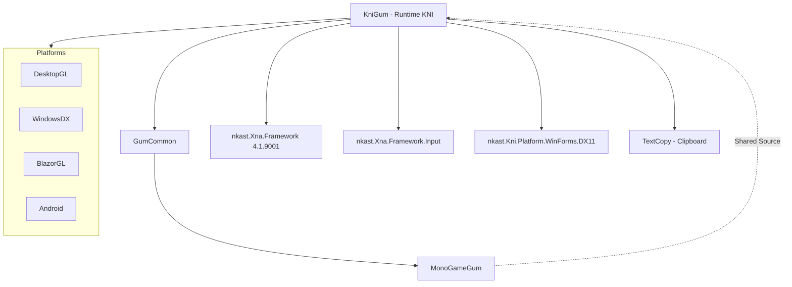

# KniGum (Runtime KNI)

## Descripción

KniGum es el runtime de Gum para el framework KNI (anteriormente conocido como nkast.Xna.Framework). KNI es una reimplementación moderna de XNA/MonoGame que mantiene compatibilidad con XNA 4.0 Refresh.

Este runtime comparte la mayoría del código con MonoGameGum a través de archivos enlazados, diferenciándose principalmente en las referencias a los assemblies de KNI.

## Diagrama de Relaciones



## Tecnología

| Aspecto | Valor |
|---------|-------|
| **Framework** | KNI (nkast.Xna.Framework) |
| **.NET** | net8.0 |
| **Lenguaje** | C# 12.0 |
| **Package** | NuGet: Gum.KNI |
| **Define Constants** | KNI (en lugar de MONOGAME) |

## Punto de Entrada

Mismo que MonoGameGum - usar `GumService.Initialize()`, `Update()`, `Draw()`.

```csharp
// Inicialización idéntica a MonoGameGum
GumService.DefaultInitialize(game);
GumService.DefaultUpdate(gameTime);
GumService.DefaultDraw(gameTime);
```

## Funcionalidades Principales

Mismas que MonoGameGum:
- Renderizado de UI completo
- Sistema Forms (Button, TextBox, etc.)
- Manejo de input
- Animaciones con keyframes
- Hot reload

**Diferencias clave vs MonoGameGum:**
- Usa `nkast.Xna.Framework` en lugar de `MonoGame.Framework`
- Compatible con proyectos XNA legacy
- Soporte para plataformas adicionales (BlazorGL, WindowsDX)
- Define constante `KNI` en lugar de `MONOGAME`

## Clases Clave

Idénticas a MonoGameGum (compartidas vía `<Compile Include="..\MonoGameGum\**\*.cs" />`):

| Clase | Propósito |
|-------|-----------|
| `GumService` | Inicialización y loopprincipal |
| `SpriteRuntime` | Wrapper para sprites |
| `TextRuntime` | Wrapper para texto |
| `InteractiveGue` | Base para controles interactivos |
| `Button`/`TextBox`/etc. | Controles Forms |

### Diferencias en Implementación

```csharp
// MonoGameGum usa:
using Microsoft.Xna.Framework;
using Microsoft.Xna.Framework.Graphics;

// KniGum usa:
using Xna.Framework;
using Xna.Framework.Graphics;
```

## Cómo Ampliar

### Adaptación desde MonoGame

Si tienes código que usa MonoGameGum:

1. **Cambiar referencias NuGet**:
   - Remover `Gum.MonoGame`
   - Añadir `Gum.KNI`

2. **Cambiar imports**:
   ```csharp
   // De:
   using Microsoft.Xna.Framework;
   // A:
   using Xna.Framework;
   ```

3. **Actualizar inicialización**:
   ```csharp
   // KNI usa GameWindow diferente
   var game = new Game(); // Usa KNI Game
   GumService.DefaultInitialize(game);
   ```

### Plataformas Específicas

| Plataforma | Assembly |
|------------|----------|
| WindowsDX | `nkast.Kni.Platform.WinForms.DX11` |
| DesktopGL | `nkast.Kni.Platform.DesktopGL` |
| BlazorGL | `nkast.Kni.Platform.BlazorGL` |
| Android | `nkast.Kni.Platform.Android` |

## Retos al Ampliar

### Compatibilidad XNA
- Código diseñado para XNA 4.0 puede requerir adaptaciones
- Algunas APIs de MonoGame no existen en KNI
- **Recomendación**: Usar `#if KNI` para código específico

### Diferencias de Namespace
- `Microsoft.Xna.Framework` vs `Xna.Framework`
- Puede causar errores de compilación en code compartido
- **Recomendación**: Usar alias o global usings

### Versiones de KNI
- KNI evoluciona rápidamente (versión 4.1+)
- Breaking changes entre versiones menores
- **Recomendación**: Fijar versión en `.csproj`

### Migración desde MonoGame
- Proyectos MonoGame existentes necesitan refactorizar imports
- Content pipeline puede diferir
- **Recomendación**: Migración gradual con ambos runtimes en paralelo