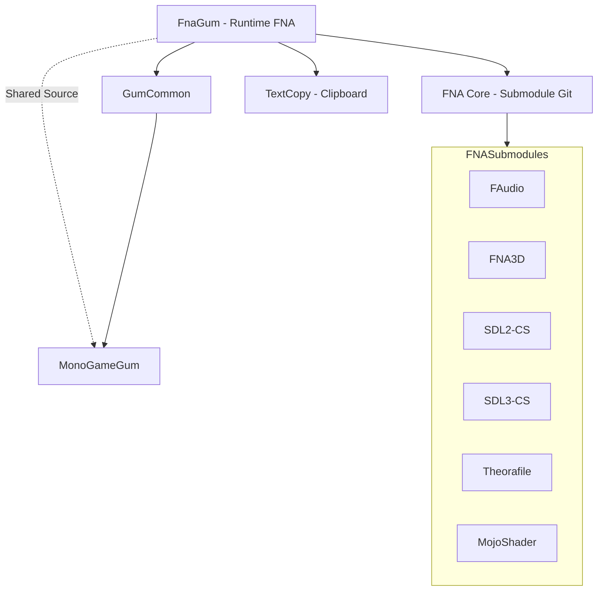

# FnaGum (Runtime FNA)

## Descripción

FnaGum es el runtime de Gum para el framework FNA (XNA 4.0 compatible). FNA es una reimplementación open-source de XNA 4.0 diseñada para ser precisa al comportamiento original de XNA de Microsoft.

Este runtime comparte código con MonoGameGum vía archivos enlazados, adaptando las referencias a FNA.

## Diagrama de Relaciones



## Tecnología

| Aspecto | Valor |
|---------|-------|
| **Framework** | FNA (XNA 4.0 compatible) |
| **.NET** | net8.0 |
| **Lenguaje** | C# 12.0 |
| **Package** | NuGet: Gum.FNA |
| **Define Constants** | FNA; XNA4 |
| **FNA Source** | Git Submodule en `fna/` |

## Punto de Entrada

Mismo que MonoGameGum:

```csharp
// Inicialización
GumService.DefaultInitialize(game);
GumService.DefaultUpdate(gameTime);
GumService.DefaultDraw(gameTime);
```

## Funcionalidades Principales

Mismas que MonoGameGum:
- Renderizado de UI completo
- Sistema Forms (Button, TextBox, etc.)
- Manejo de input
- Animaciones con keyframes
- Hot reload

**Diferencias clave:**
- Usa FNA en lugar de MonoGame/KNI
- Compatible al 100% con XNA 4.0 Refresh de Microsoft
- Ideal para ports de juegos XNA legacy
- Define constantes `FNA` y `XNA4`

## Clases Clave

Compartidas con MonoGameGum:

| Clase | Propósito |
|-------|-----------|
| `GumService` | Inicialización y loop principal |
| `SpriteRuntime` | Wrapper para sprites |
| `TextRuntime` | Wrapper para texto |
| `InteractiveGue` | Base para controles interactivos |
| `Button`/`TextBox`/etc. | Controles Forms |

### Diferencias de Namespace

```csharp
// MonoGame:
using Microsoft.Xna.Framework;

// FNA:
using Microsoft.Xna.Framework; // Same namespace!
```

FNA mantiene los namespaces originales de XNA, facilitando la migración.

## Cómo Ampliar

### Migración desde XNA 4.0

Si tienes un juego XNA 4.0:

1. **Cambiar referencias**:
   - Remover referencias a XNA de Microsoft
   - Añadir `Gum.FNA` package

2. **Usar FNA**:
   - El código XNA existente funciona sin cambios (en la mayoría de casos)

3. **Inicializar Gum**:
   ```csharp
   public class MyGame : Microsoft.Xna.Framework.Game
   {
       protected override void Initialize()
       {
           GumService.DefaultInitialize(this);
           base.Initialize();
       }
       // ... mismo código que XNA
   }
   ```

### Compilación desde Source

```bash
# FNA viene como git submodule
git submodule update --init --recursive

# El csproj referencia FNA.Core.csproj directamente
```

## Retos al Ampliar

### Dependencia de Submodule
- FNA está enlazado como git submodule
- Requiere `--init --recursive` al clonar
- **Recomendación**: Documentar pasos de setup en README

### Plataformas Limitadas
- FNA soporta principalmente Desktop (Windows, Linux, macOS)
- No soporta móviles nativamente (iOS, Android)
- **Recomendación**: Usar MonoGameGum para móviles

### SDL Dependencies
- FNA depende de SDL2 via SDL2-CS
- Requiere DLLs nativos distribuidos con el juego
- **Recomendación**: Usar FNA's native dependency helper

### Content Pipeline
- FNA no incluye Content Pipeline
- Los assets deben estar pre-compilados (XNB) o usar formato raw
- **Recomendación**: Usar herramientas de compilación de XNA o alternativas