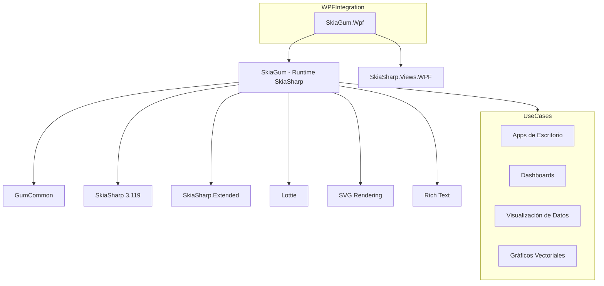

# SkiaGum (Runtime SkiaSharp)

## Descripción

SkiaGum es el runtime de Gum para SkiaSharp, una librería de gráficos vectoriales 2D de alto rendimiento. A diferencia de los runtimes basados en XNA/MonoGame, SkiaGum está diseñado para aplicaciones no-juego (aplicaciones de escritorio, controles UI, visualización de datos).

Este runtime es ideal para aplicaciones WPF/Avalonia que necesitan renderizado vectorial de alta calidad, soporte SVG y animaciones Lottie.

## Diagrama de Relaciones



## Tecnología

| Aspecto | Valor |
|---------|-------|
| **Framework** | SkiaSharp (Google Skia para .NET) |
| **.NET** | net8.0 |
| **Lenguaje** | C# 12.0 |
| **Package** | NuGet: Gum.SkiaSharp |
| **Define Constant** | SKIA |

## Punto de Entrada

| Clase | Método | Uso |
|-------|--------|-----|
| `GumService` | `Initialize(SKCanvas canvas)` | Inicializa con canvas Skia |
| `GumService` | `Draw()` | Renderiza al canvas |

```csharp
// Ejemplo con SkiaSharp
using SkiaSharp;
using Gum.Skia;

public void Render(SKCanvas canvas)
{
    GumService.Initialize(canvas);
    // Cargar elementos Gum...
    GumService.Draw();
}

// Ejemplo WPF con SkiaGum.Wpf
// Usar SKCanvasView de SkiaSharp.Views.WPF
```

## Funcionalidades Principales

- Renderizado vectorial de alta calidad (anti-aliasing, transforms)
- Soporte SVG nativo (vía Svg.Skia)
- Animaciones Lottie (.json, .lottie)
- Texto enriquecido (vía RichTextKit)
- Sin dependencia de game loop
- Integración con WPF, Avalonia, MAUI

**Diferencias vs runtimes XNA:**
- No tiene sistema de input (renderizado pasivo)
- Usa canvas-based rendering
- Ideal para aplicaciones de escritorio

## Clases Clave

| Clase | Propósito |
|-------|-----------|
| `GumService` | Inicialización y renderizado |
| `SystemManagers` | Gestiona canvas y renderer |
| `Renderer` | Implementación de IRenderer para Skia |
| `Sprite` | Sprite basado en Skia |
| `Text` | Texto usando Skia typography |
| `SolidRectangle` | Rectángulo relleno |
| `LottieAnimation` | Animaciones Lottie |
| `SvgRuntime` | Renderizado SVG |

### Renderables

| Clase | Características |
|-------|-----------------|
| `Sprite` | Imágenes bitmap |
| `Text` | Texto con fuentes Skia |
| `SolidRectangle` | Rectángulos rellenos |
| `Arc` | Arcos y círculos |
| `RoundedRectangle` | Rectángulos redondeados |
| `Canvas` | Container para childs |
| `SvgRuntime` | Vector graphics SVG |
| `LottieAnimation` | Animaciones vectoriales |

## Cómo Ampliar

### Crear RenderableCustom

```csharp
public class MyCustomRenderable : IRenderable
{
    public SKPath Path { get; set; }
    public SKPaint Paint { get; set; }
    
    public void Render(ISystemManagers managers)
    {
        var skiaManagers = managers as SkiaSystemManagers;
        skiaManagers.Canvas.DrawPath(Path, Paint);
    }
    
    public BlendState BlendState { get; set; }
    public bool Wrap { get; set; }
    public string BatchKey => "MyCustomRenderable";
}
```

### Integración WPF

```csharp
// En UserControlWPF
public partial class MyGumControl : UserControl
{
    private SKCanvasView _canvasView;
    private GumService _gumService;
    
    public MyGumControl()
    {
        _canvasView = new SKCanvasView();
        _canvasView.PaintSurface += OnPaintSurface;
        Content = _canvasView;
    }
    
    private void OnPaintSurface(object sender, SKPaintSurfaceEventArgs e)
    {
        _gumService.Draw(e.Surface.Canvas);
    }
}
```

### Cargar SVG

```csharp
var svgElement = new SvgRuntime();
svgElement.SetProperty("Source", "path/to/image.svg");
svgElement.SetProperty("Width", 100);
svgElement.SetProperty("Height", 100);
container.AddChild(svgElement);
```

### Cargar Animación Lottie

```csharp
var lottie = new LottieAnimation();
lottie.SetProperty("Source", "path/to/animation.json");
lottie.SetProperty("Width", 200);
lottie.SetProperty("Height", 200);
lottie.Play();
container.AddChild(lottie);
```

## Retos al Ampliar

### Sin Sistema de Input
- SkiaGum es para renderizado pasivo
- No tiene mouse/keyboard events built-in
- **Recomendación**: Conectar events WPF/MAUI al sistema Gum manualmente

### Sistema de Coordenadas
- Skia usa Y hacia abajo (como Gum)
- Canvas size vs Viewport size
- **Recomendación**: Usar `Canvas.LocalBounds` para cálculos

### Performance
- Cada elemento es un draw call
- SVG complejos pueden ser lentos
- **Recomendación**: Cachear bitmaps para elementos estáticos

### Fuentes
- Skia usa sistema de fuentes propio
- No todas las fuentes XNA están disponibles
- **Recomendación**: Usar fuentes TrueType embebidas o Skia's typeface manager

### Integración Frameworks
- Cada framework (WPF, Avalonia, MAUI) tiene su own canvas integration
- **Recomendación**: Usar bindings específicos (SkiaGum.Wpf, SkiaGum.Maui)