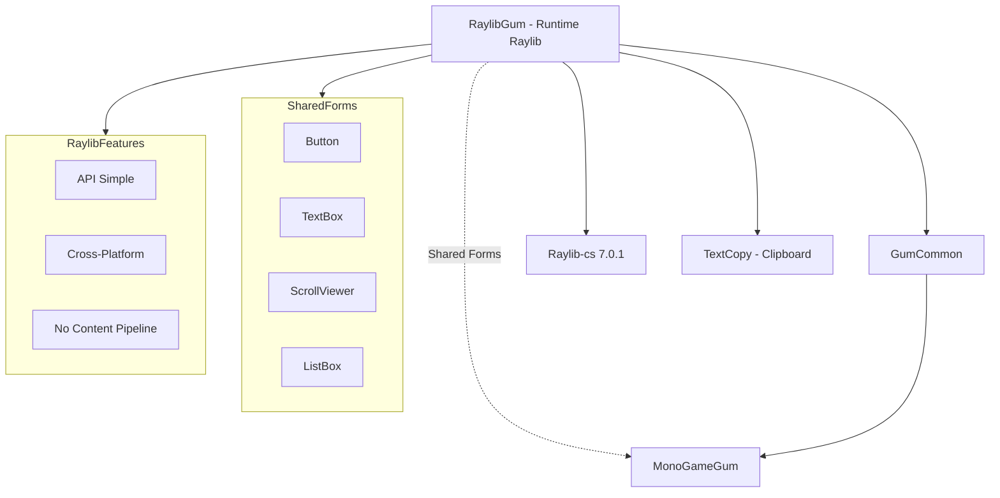

# RaylibGum (Runtime Raylib)

## Descripción

RaylibGum es el runtime de Gum para Raylib-cs, los bindings de C# para la librería C Raylib. Raylib es una librería de juegos simple y fácil de usar, ideal para prototipado rápido y juegos indie.

Este runtime comparte los controles Forms de MonoGameGum vía archivos enlazados, permitiendo UI rica en juegos basados en Raylib.

## Diagrama de Relaciones



## Tecnología

| Aspecto | Valor |
|---------|-------|
| **Framework** | Raylib-cs (Raylib C# bindings) |
| **.NET** | net8.0 |
| **Lenguaje** | C# 12.0 |
| **Package** | NuGet: Gum.raylib |
| **Define Constant** | RAYLIB |

## Punto de Entrada

| Clase | Método | Uso |
|-------|--------|-----|
| `GumService` | `Initialize()` | Inicializa Gum con Raylib |
| `GumService` | `Update()` | Actualiza lógica |
| `GumService` | `Draw()` | Renderiza UI |

```csharp
// Ejemplo con Raylib
using Raylib_cs;
using Gum.Raylib;

public class MyGame
{
    public void Run()
    {
        Raylib.InitWindow(800, 600, "My Game");
        
        GumService.Initialize();
        
        while (!Raylib.WindowShouldClose())
        {
            Raylib.BeginDrawing();
            Raylib.ClearBackground(Color.RAYWHITE);
            
            GumService.Update();
            GumService.Draw();
            
            Raylib.EndDrawing();
        }
        
        Raylib.CloseWindow();
    }
}
```

## Funcionalidades Principales

- Renderizado de UI con Raylib
- Sistema Forms completo (compartido con MonoGameGum)
- Manejo de input (mouse, keyboard)
- Animaciones con keyframes
- Sin content pipeline (carga directa de archivos)

**Diferencias vs MonoGameGum:**
- API más simple sin content pipeline
- Raylib puro (no XNA compatibility layer)
- Ideal para prototipado rápido
- Bindings C# sobre librería C nativa

## Clases Clave

### Sistema

| Clase | Propósito |
|-------|-----------|
| `SystemManagers` | Gestor del sistema Raylib |
| `Renderer` | Implementación de IRenderer para Raylib |
| `GumService` | Punto de entrada principal |

### Renderables

| Clase | Propósito |
|-------|-----------|
| `Sprite` | Imágenes con Raylib textures |
| `Text` | Texto con Raylib fonts |
| `SolidRectangle` | Rectángulos rellenos |
| `SpriteRuntime` | Wrapper de GraphicalUiElement |
| `TextRuntime` | Wrapper para texto |

### Input (Compartido con MonoGameGum)

| Clase | Propósito |
|-------|-----------|
| `Cursor` | Mouse/touch input |
| `Keyboard` | Keyboard input |

### Forms (Compartido vía linked files)

| Clase | Propósito |
|-------|-----------|
| `Button` | Botón con estados |
| `TextBox` | Entrada de texto |
| `ComboBox` | Dropdown |
| `ScrollViewer` | Container con scroll |
| `ListBox` | Lista scrollable |

## Cómo Ampliar

### Crear Renderable Custom

```csharp
public class MyRaylibSprite : GraphicalUiElement
{
    private Texture2D _texture;
    private Rectangle _sourceRect;
    
    public MyRaylibSprite(Texture2D texture) : base()
    {
        _texture = texture;
        _sourceRect = new Rectangle(0, 0, texture.width, texture.height);
    }
    
    public override void Render(ISystemManagers managers)
    {
        var raylibManagers = managers as RaylibSystemManagers;
        Raylib.DrawTextureRec(
            _texture,
            _sourceRect,
            new Vector2(this.X, this.Y),
            Color.WHITE
        );
    }
}
```

### Cargar Archivos

```csharp
// Raylib carga directo sin content pipeline
var texture = Raylib.LoadTexture("assets/image.png");
var font = Raylib.LoadFont("assets/font.ttf");

var sprite = new SpriteRuntime();
sprite.Texture = texture;
```

### Input Handling

```csharp
// Usar Cursor compartido
if (Cursor.PrimaryPushed)
{
    var element =<ElementAtPoint>(Cursor.X, Cursor.Y);
    // Manejar click
}

// Keyboard
if (Gum.InputLibrary.Keyboard.KeyPushed(Key.R))
{
    // Tecla R presionada
}
```

## Retos al Ampliar

### Textura Management
- Raylib no tiene ContentManager
- Texturas no se liberan automáticamente
- **Recomendación**: Implementar un TextureManager custom

### Fuentes
- Raylib usa fuentes BMFont o TTF nativo
- Formato diferente a XNA SpriteFont
- **Recomendación**: Usar `Raylib.LoadFont()` o BMFont con Raylib

### Multi-Plataforma
- Raylib compila a múltiples plataformas
- Pero los bindings C# pueden tener diferencias
- **Recomendación**: Probar en todas las plataformas objetivo

### Bufering
- Raylib no tiene SpriteBatch como XNA
- Cada draw call es inmediato
- **Recomendación**: Minimizar draw calls, agrupar por textura

### Binding Stability
- Raylib-cs puede tener breaking changes entre versiones
- Algunas APIs pueden faltar o estar incompletas
- **Recomendación**: Fijar versión de Raylib-cs explícitamente