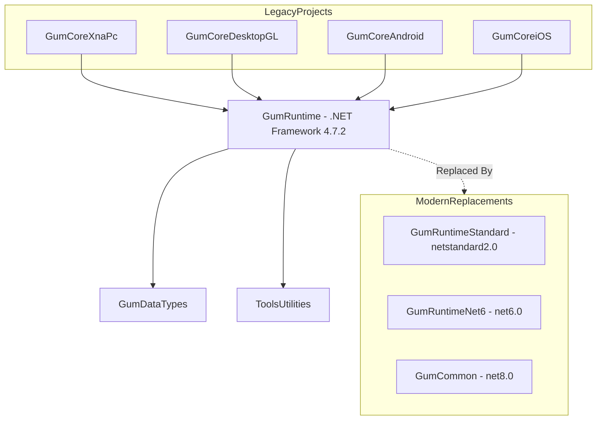

# GumRuntime (Runtime Legacy .NET Framework)

## Descripción

GumRuntime es la versión legacy del runtime de Gum para .NET Framework 4.7.2. Contiene la clase `GraphicalUiElement` base y extensiones para trabajar con los tipos de datos guardados (`ElementSave`, `InstanceSave`, etc.).

Este proyecto es mantenido para compatibilidad con proyectos legacy que aún usan .NET Framework.

## Diagrama de Relaciones



## Tecnología

| Aspecto | Valor |
|---------|-------|
| **Framework** | .NET Framework 4.7.2 |
| **Lenguaje** | C# 7.3 (default) |
| **Define Constants** | NO_XNA; MONOGAME |
| **Estado** | Legacy - Mantenido para compatibilidad |

## Punto de Entrada

No tiene punto de entrada ejecutable. Clases principales:

| Clase | Propósito |
|-------|-----------|
| `GraphicalUiElement` | Clase base para elementos UI |
| `InteractiveGue` | Elemento interactivo con eventos |
| `BindableGue` | Elemento con binding (deprecated) |

## Funcionalidades Principales

- Clase `GraphicalUiElement` base (6955+ líneas)
- Extension methods para `ElementSave`, `InstanceSave`, `StateSave`
- Creación de instancias desde saved data
- Aplicación de estados a elementos

## Clases Clave

| Clase | Responsabilidad |
|-------|-----------------|
| **GraphicalUiElement** | Clase base principal con: layout, parenting, rendering, state management |
| **InteractiveGue** | Extensión con eventos de input (click, hover, etc.) |
| **BindableGue** | (Deprecated) Binding support |

### Extension Methods

| Método Extensión | Ubicación | Propósito |
|------------------|-----------|-----------|
| `ElementSaveExtensions` | Linked from Gum\DataTypes | Métodos para ElementSave |
| `InstanceSaveExtensions` | Linked from Gum\DataTypes | Métodos para InstanceSave |
| `StateSaveExtensions` | Linked from Gum\DataTypes | Métodos para StateSave |
| `VariableSaveExtensions` | Linked from Gum\DataTypes | Métodos para VariableSave |

### Archivos Enlazados

El proyecto enlaza archivos desde:
- `Gum\DataTypes\**\*.cs` - Tipos de datos
- `Gum\Managers\**\*.cs` - Managers
- `RenderingLibrary\**\*.cs` - Render abstractions

## Cómo Ampliar

### Actualmente No Recomendado

Para nuevos proyectos, usar:
- **GumCommon** para .NET 8.0+
- **GumRuntimeNet6** para .NET 6.0+
- **GumRuntimeStandard** para netstandard2.0

### Migración desde GumRuntime

```csharp
// Código legacy con GumRuntime:
using GumRuntime;

// Migrar a GumCommon:
using Gum;
using Gum.StateAnimation.Runtime;

// GraphicalUiElement está en ambos
// InteractiveGue está en ambos
// Los extension methods están en ambos
```

## Retos al Ampliar

### EOL .NET Framework
- .NET Framework 4.7.2 está en End-of-Life
- Microsoft ya no lo desarrolla activamente
- **Recomendación**: Migrar a .NET 8+ o .NET Standard 2.0

### Compatibilidad Limitada
- No soporta nuevas features de C# 10+
- No soporta nuevas APIs de .NET
- **Recomendación**: Usar GumRuntimeStandard para compatibilidad máxima

### Performance
- Sin optimizaciones modernas de runtime
- Sin Span<T>, Memory<T> nativos
- **Recomendación**: Considerar migración para performance crítico

### Código Duplicado
- Archivos compartidos vía linking
- Cambios pueden romper múltiples proyectos
- **Recomendación**: Usar shared projects (.shproj) modernos