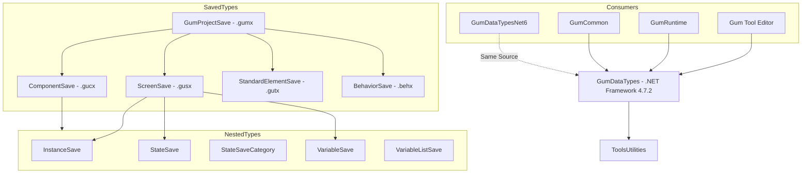
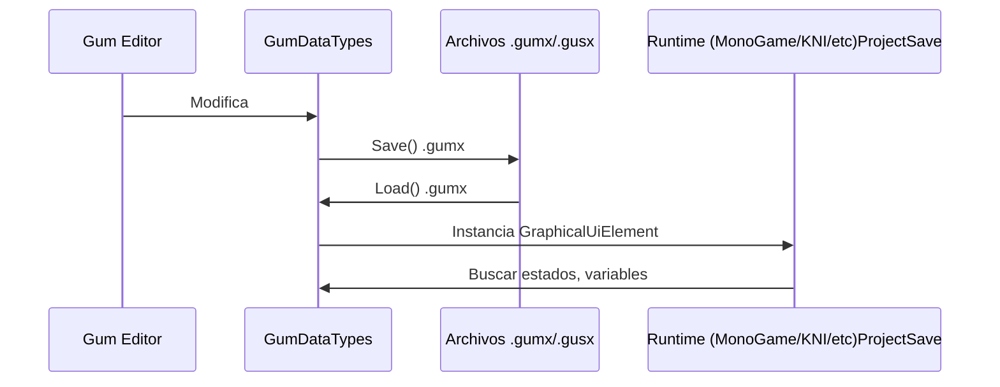

# GumDataTypes (Tipos de Datos Principales)

## Descripción

GumDataTypes contiene todos los tipos de datos que definen la estructura de un proyecto Gum. Estos tipos son clases POCO serializables a XML que representan pantallas, componentes, instancias, estados, variables y behaviors.

Es el modelo de datos persistente utilizado tanto por el editor Gum como por los runtimes para cargar proyectos `.gumx`.

## Diagrama de Relaciones



## Tecnología

| Aspecto | Valor |
|---------|-------|
| **Framework** | .NET Framework 4.7.2 |
| **Lenguaje** | C# 7.3 |
| **Serialización** | XML |
| **Estado** | Activo (legacy target) |

## Tipos Principales

### Contenedor Raíz

| Clase | Archivo | Extensión |
|-------|---------|-----------|
| `GumProjectSave` | Proyecto completo | .gumx |

### Elementos

| Clase | Propósito | Extensión |
|-------|-----------|-----------|
| `ScreenSave` | Pantalla de UI | .gusx |
| `ComponentSave` | Componente reutilizable | .gucx |
| `StandardElementSave` | Elemento estándar (Text, Sprite, etc.) | .gutx |

### Anidados

| Clase | Propósito |
|-------|-----------|
| `InstanceSave` | Instancia de un elemento dentro de otro |
| `StateSave` | Colección de valores de variables para un estado |
| `StateSaveCategory` | Categoría de estados (ej: ButtonStates) |
| `VariableSave` | Variable individual con nombre y valor |
| `VariableListSave<T>` | Variable de tipo lista |
| `BehaviorSave` | Definición de behavior reutilizable |
| `ElementBehaviorReference` | Referencia de elemento a behavior |

### Enums

| Enum | Valores |
|------|---------|
| `DimensionUnitType` | Absolute, PercentageOfParent, RelativeToChildren, Ratio, etc. |
| `StandardElementTypes` | Text, Sprite, Container, NineSlice, ColoredRectangle, Polygon, Circle |
| `HorizontalAlignment` | Left, Center, Right |
| `VerticalAlignment` | Top, Center, Bottom |

## Estructura XML

### Ejemplo de Screen (.gusx)

```xml
<ScreenSave>
  <Name>MainMenu</Name>
  <BaseType>Screen</BaseType>
  <States>
    <StateSave>
      <Name>Default</Name>
      <Variables>
        <VariableSave>
          <Name>X</Name>
          <Value>0</Value>
          <Type>float</Type>
        </VariableSave>
      </Variables>
    </StateSave>
  </States>
  <Instances>
    <InstanceSave>
      <Name>Button1</Name>
      <BaseType>Button</BaseType>
    </InstanceSave>
  </Instances>
</ScreenSave>
```

### Ejemplo de Behavior (.behx)

```xml
<BehaviorSave>
  <Name>ButtonBehavior</Name>
  <RequiredVariables>
    <VariableSave>
      <Name>IsEnabled</Name>
      <Type>bool</Type>
    </VariableSave>
  </RequiredVariables>
</BehaviorSave>
```

## Cómo Ampliar

### Añadir Nuevo Tipo de Elemento

1. **Crear clase**:
```csharp
public class MyCustomElementSave : ElementSave
{
    public override string FileExtension => "myext";
    public override string Subfolder => "MyElements";
    
    // Añadir propiedades específicas
    public string CustomProperty { get; set; }
}
```

2. **Registrar en GumProjectSave**:
```csharp
public class GumProjectSave
{
    public List<MyCustomElementSave> MyCustomElements { get; set; }
}
```

### Añadir Nuevo Tipo de Variable

```csharp
// VariableSave soporta多种types vía object Value
// Para types custom, usar conversión:

var variable = new VariableSave
{
    Name = "MyCustomProperty",
    Type = "MyCustomType",
    Value = myCustomObject // Debe ser XML-serializable
};
```

### Extender DimensionUnitType

```csharp
// Añadir al enum (en archivo compartido)
public enum DimensionUnitType
{
    // ... existing values
    MyCustomUnit// Añadir aquí
}
```

## Retos al Ampliar

### Versionado de Archivos
- XML tiene formato versionado (AttributeVersion vsVersion 1)
- Cambios de schema rompen compatibilidad con archivos antiguos
- **Recomendación**: Añadir atributos opcionales con defaults

### Serialización Circular
- Referencias entre elementos pueden causar loops
- `ObjectFinder` resuelve referencias post-carga
- **Recomendación**: Usar referencias por nombre (string) no por objeto

### Compatibilidad Multi-Plataforma
- GumDataTypes es .NET Framework 4.7.2
- GumDataTypesNet6 comparte el mismo código
- **Recomendación**: Evitar APIs específicas de framework

### Tamaño de Archivos
- Proyectos grandes generan XML grande
- No hay soporte para binario
- **Recomendación**: Considerar formato alternativo para proyectos gigantes

## Flujo de Datos

