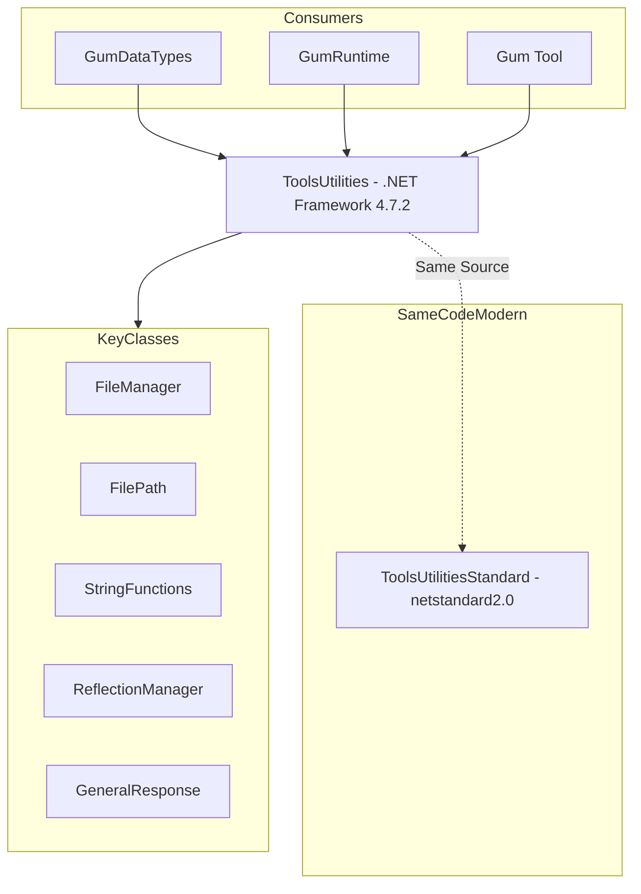

# ToolsUtilities (Utilidades de Archivos/Serialización)

## Descripción

ToolsUtilities es una librería de utilidades que proporciona funcionalidad de manejo de archivos, serialización XML, reflexión y helpers matemáticos. Es utilizada por GumDataTypes y otros proyectos del ecosistema Gum para operaciones de bajo nivel.

## Diagrama de Relaciones



## Tecnología

| Aspecto | Valor |
|---------|-------|
| **Framework** | .NET Framework 4.7.2 |
| **Lenguaje** | C# 7.3 |
| **Dependencias** | Ninguna (puro .NET) |
| **Package** | FlatRedBall.ToolsUtilities |

## Clases Principales

### FileManager

| Método | Propósito |
|--------|-----------|
| `XmlSerialize()` | Serializa objeto a XML |
| `XmlDeserialize()` | Deserializa XML a objeto |
| `SaveText()` | Guarda texto a archivo |
| `LoadText()` | Carga texto desde archivo |
| `GetAllFilesInDirectory()` | Lista archivos recursivamente |
| `CreateDirectory()` | Crea directorios anidados |
| `DeleteDirectory()` | Elimina directorio con contenido |

### FilePath

| Propiedad/Método | Propósito |
|------------------|-----------|
| `FullPath` | Ruta completa normalizada |
| `Extension` | Extensión del archivo |
| `Directory` | Directorio padre |
| `NoExtension` | Ruta sin extensión |
| `IsRelative` | Si es ruta relativa |
| `RelativeTo()` | Convierte a ruta relativa |

### StringFunctions

| Método | Propósito |
|--------|-----------|
| `RemoveWhitespace()` | Elimina espacios |
| `SplitBySpaces()` | Divide por espacios |
| `After()` | Texto después de substring |
| `Before()` | Texto antes de substring |

### ReflectionManager

| Método | Propósito |
|--------|-----------|
| `GetProperty()` | Obtiene propiedad por reflexión |
| `SetProperty()` | Establece propiedad |
| `GetMethod()` | Obtiene método |
| `CreateInstance()` | Crea instancia dinámica |

### GeneralResponse

| Propiedad | Propósito |
|-----------|-----------|
| `Succeeded` | Si la operación fue exitosa |
| `Data` | Datos resultado |
| `Message` | Mensaje de error/éxito |

## Cómo Ampliar

### Añadir Método de Serialización

```csharp
public static class FileManagerExtensions
{
    public static void JsonSerialize(object obj, string filePath)
    {
        var json = JsonSerializer.Serialize(obj);
        FileManager.SaveText(json, filePath);
    }
    
    public static T JsonDeserialize(string filePath)
    {
        var json = FileManager.LoadText(filePath);
        return JsonSerializer.Deserialize(json);
    }
}
```

### Añadir Método de FilePath

```csharp
public partial class FilePath
{
    public FilePath ChangeExtension(string newExtension)
    {
        return new FilePath(
            System.IO.Path.ChangeExtension(this.FullPath, newExtension)
        );
    }
}
```

### Manejo de Errores Custom

```csharp
public class FileManagerWithErrorHandling
{
    public static GeneralResponse SafeLoad(string path)
    {
        try
        {
            var data = FileManager.LoadText(path);
            return new GeneralResponse { Succeeded = true, Data = data };
        }
        catch (Exception ex)
        {
            return new GeneralResponse 
            { 
                Succeeded = false, 
                Message = ex.Message 
            };
        }
    }
}
```

## Retos al Ampliar

### Compatibilidad Multi-Plataforma
- ToolsUtilities usa APIs de Windows a veces
- ToolsUtilitiesStandard aborda esto con #ifdef
- **Recomendación**: Usar `Platform` abstraction

### Codificación de Archivos
- XML asume UTF-8 pero puede haber inconsistencias
- Archivos legacy pueden tener BOM
- **Recomendación**: Especificar codificación explícitamente

### Rutas con Caracteres Especiales
- No maneja bien caracteres no-ASCII en rutas
- Problemas en Windows vs Linux
- **Recomendación**: Normalizar rutas con `Path.GetFullPath()`

### Thread Safety
- FileManager no es thread-safe
- Operaciones concurrentes pueden fallar
- **Recomendación**: Usar locks para operaciones simultáneas

## Versiones

| Proyecto | Target | Estado|
|----------|--------|-------|
| **ToolsUtilities** | .NET Framework 4.7.2 | Legacy, activo |
| **ToolsUtilitiesStandard** | netstandard2.0 | Moderno, recomendado |

Ambos proyectos comparten el mismo código fuente vía linked files.

## Uso Típico

```csharp
// Cargar archivo XML
var project = FileManager.XmlDeserialize(
    filePath,typeof(GumProjectSave)
) as GumProjectSave;

// Guardar archivo XML
FileManager.XmlSerialize(project, typeof(GumProjectSave), savePath);

// Trabajar con rutas
var path = new FilePath("Content/Screens/Menu.gusx");
var relative = path.RelativeTo(projectDirectory);
var absolute = path.AbsolutePath;

// Operaciones de texto
var name = StringFunctions.After(fileName, "_", returnNullIfNotFound: true);

// Reflexión
var property = ReflectionManager.GetProperty(obj, "Width");
var value = property.GetValue(obj);
```