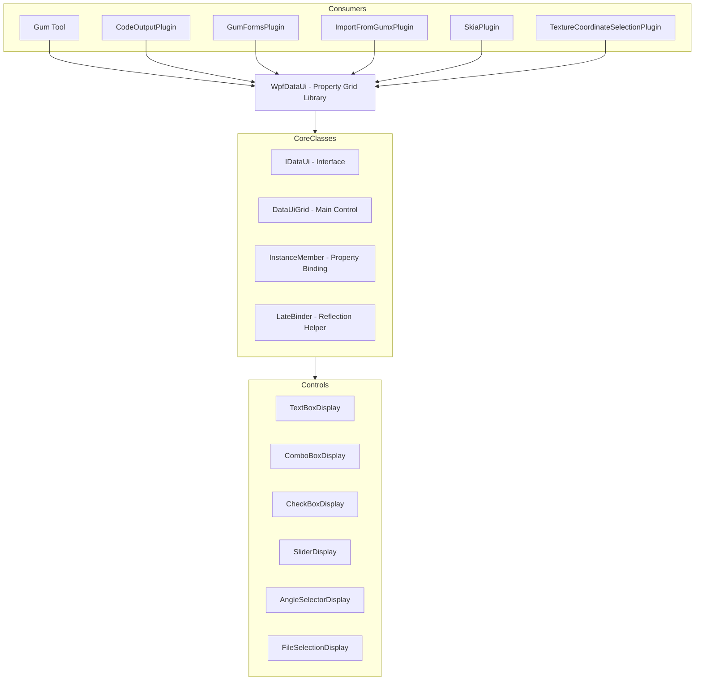
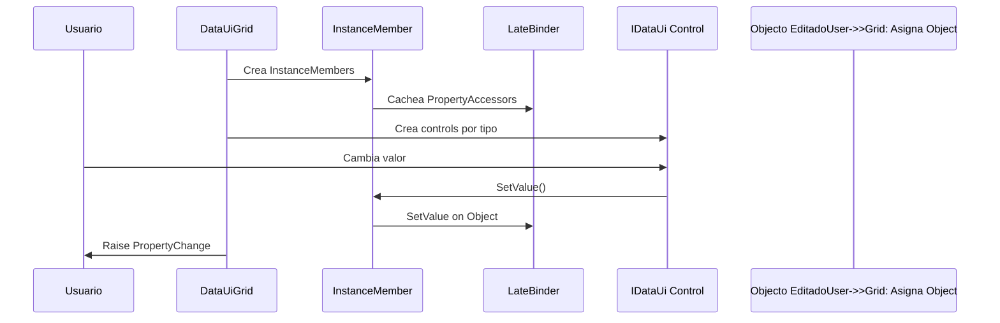

# WpfDataUi (Librería de PropertyGrid)

## Descripción

WpfDataUi es una librería WPF que proporciona un sistema de Property Grid similar al de Visual Studio. Permite generar automáticamente controles de UI para editar propiedades de objetos mediante reflexión, con soporte para categorías, validacióny tipos custom.

Es utilizada extensivamente por el editor Gum para mostrar y editar propiedades de elementos, instancias y variables.

## Diagrama de Relaciones



## Tecnología

| Aspecto | Valor |
|---------|-------|
| **Framework** | WPF (Windows Presentation Foundation) |
| **.NET** | net8.0-windows |
| **Lenguaje** | C# 12.0 |
| **Dependencias** | Ninguna (puro WPF) |

## Clases Principales

### Interfaces

| Interfaz | Propósito |
|----------|-----------|
| `IDataUi` | Contrato para todos los controles de UI |
| `IDataUiExtension` | Extensiones para IDataUi |

### DataUiGrid (Control Principal)

| Propiedad/Método | Propósito |
|------------------|-----------|
| `Instance` | Objeto siendo editado |
| `Categories` | Categorías de propiedades |
| `Refresh()` | Refresca todos los controles |
| `MoveMemberToCategory()` | Mueve propiedad a categoría |

### InstanceMember (Binding)

| Propiedad | Propósito |
|-----------|-----------|
| `Name` | Nombre de la propiedad |
| `PropertyType` | Tipo de la propiedad |
| `Category` | Categoría para agrupar |
| `PreferredDisplayer` | Tipo de control preferido |
| `CustomGetEvent` | Getter custom |
| `CustomSetEvent` | Setter custom |

### LateBinder (Reflexión Rápida)

| Método | Propósito |
|--------|-----------|
| `GetValue()` | Obtiene valor vía IL generation |
| `SetValue()` | Establece valor |
| `GetProperty()` | Obtiene PropertyInfocacheado |

## Controles Disponibles

| Control | Tipo de Dato |
|---------|--------------|
| `TextBoxDisplay` | string, int, float, double |
| `ComboBoxDisplay` | Enums, listas de opciones |
| `CheckBoxDisplay` | bool |
| `SliderDisplay` | float, double (con rango) |
| `AngleSelectorDisplay` | float (ángulo con visual) |
| `FileSelectionDisplay` | string (path) |
| `NullableBoolDisplay` | bool? |
| `ListBoxDisplay` | List<string> |

## Cómo Ampliar

### Crear Control Custom

```csharp
// 1. Implementar IDataUi
public class MyCustomDisplay : UserControl, IDataUi
{
    private InstanceMember _instanceMember;
    
    public InstanceMember InstanceMember
    {
        get => _instanceMember;
        set
        {
            _instanceMember = value;
            UpdateDisplay();
        }
    }
    
    public object GetValue()
    {
        return myControl.Value;
    }
    
    public void SetValue(object value)
    {
        myControl.Value = value;
    }
    
    public void UpdateDisplay()
    {
        // Actualizar UI basado en InstanceMember
    }
    
    public void HandleInstanceMemberPropertyChanged()
    {
        // Reaccionar a cambios en la propiedad
    }
}

// 2. Registrar el control
instanceMember.PreferredDisplayer = typeof(MyCustomDisplay);
```

### Usar Categorías

```csharp
// Usar atributo Category
public class MyObject
{
    [Category("Appearance")]
    public string Color { get; set; }
    
    [Category("Layout")]
    public int Width { get; set; }
}

// O programáticamente
dataUiGrid.MoveMemberToCategory("Color", "Appearance");
```

### Custom Getter/Setter

```csharp
var member = new InstanceMember("CustomProperty", myObject);
member.CustomGetEvent = (obj) =>
{
    // Lógica custom de lectura
    return CalculateValue();
};
member.CustomSetPropertyEvent = (obj, value) =>
{
    // Lógica custom de escritura
    ApplyValue(value);
};
```

## Retos al Ampliar

### Performance con Many Properties
- Cada propiedad crea un control WPF
- UIs con cientos de propiedades son lentas
- **Recomendación**: Virtualización o lazy loading

### Nullable Types
- WPF tiene problemas con null values
- Nullables requieren handling especial
- **Recomendación**: Usar `NullableBoolDisplay` para bool?

### Threading
- WPF requiere operaciones UI en dispatcher thread
- Cambios desde background threads fallan
- **Recomendación**: Usar `Application.Current.Dispatcher.Invoke()`

### Memory Leaks
- Event handlers no desconectados
- Referencias mantenidas innecesariamente
- **Recomendación**: Usar WeakReference o desconectar eventos

## Uso Típico

```csharp
// Crear el grid
var grid = new DataUiGrid();

// Asignar objeto
grid.Instance = myObject;

// Configurar cómo mostrar
grid.InstanceMembers[0].Category = "Layout";
grid.InstanceMembers[1].PreferredDisplayer = typeof(SliderDisplay);

// Refrescar
grid.Refresh();

// Suscribirse a cambios
grid.PropertyChange += (sender, args) =>
{
    Console.WriteLine($"Property {args.PropertyName} changed to {args.NewValue}");
};
```

## Arquitectura

