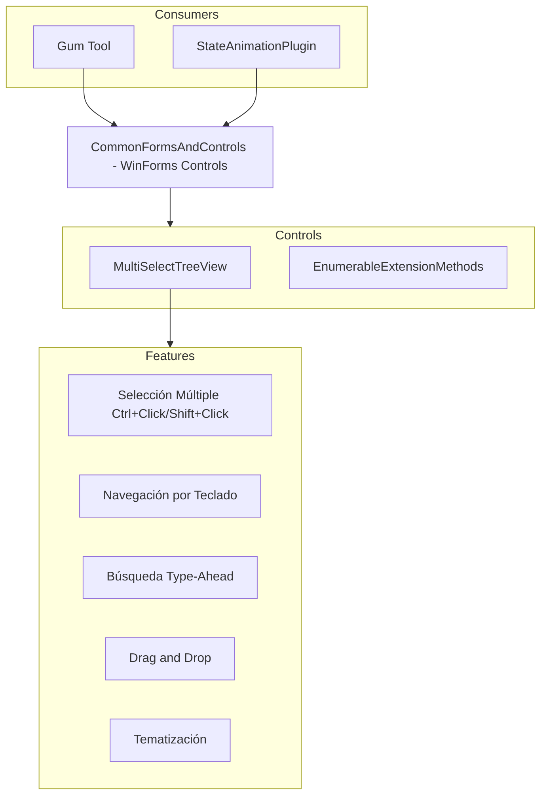

# CommonFormsAndControls (Controles WinForms Reutilizables)

## Descripción

CommonFormsAndControls es una librería de controles Windows Forms con funcionalidad mejorada, diseñada para ser reusable en proyectos de herramientas de desarrollo de juegos. El control principal es `MultiSelectTreeView`, un TreeView con soporte para selección múltiple.

Es utilizada por el editor Gum y plugins para mostrar jerarquías de elementos con capacidad de selección múltiple.

## Diagrama de Relaciones



## Tecnología

| Aspecto | Valor |
|---------|-------|
| **Framework** | Windows Forms (WinForms) |
| **.NET** | net8.0-windows |
| **Lenguaje** | C# 12.0 |
| **Dependencias** | Ninguna (puro WinForms) |

## Clases Principales

### MultiSelectTreeView

| Propiedad/Método | Propósito |
|------------------|-----------|
| `SelectedNodes` | Lista de nodos seleccionados |
| `MultiSelectBehavior` | Comportamiento de selección (CtrlDown, RegularClick) |
| `AfterClickSelect` | Evento post-selección |
| `SelectAll()` | Selecciona todos los nodos |

### Eventos

| Evento | Propósito |
|--------|-----------|
| `AfterClickSelect` | Después de selección por click |
| `KeyDown` | Manejo de teclas (heredado) |
| `ItemDrag` | Inicio de drag |

### EnumerableExtensionMethods

| Método | Propósito |
|--------|-----------|
| `AddRange()` | Añade múltiples items |
| `ForEach()` | Itera con acción |

## Funcionalidades Principales

### Multi-Selección

```csharp
// Comportamientos disponibles
public enum MultiSelectBehavior
{
    CtrlDown,      // Ctrl+Click para toggle
    RegularClick   // Click simple añade a selección
}

// Configuración
treeView.MultiSelectBehavior = MultiSelectBehavior.CtrlDown;
```

### Navegación por Teclado

| Tecla | Acción |
|-------|--------|
| ↑/↓ | Navegar nodos |
| Home | Primer nodo |
| End | Último nodo |
| PageUp/PageDown | Página arriba/abajo |
| Ctrl+A | Seleccionar todo |
| Ctrl+Click | Toggle selección |
| Shift+Click | Selección por rango |

### Type-AAhead Search

```csharp
// El control busca nodos cuando se escribe
// Configuración implícita - simplemente empezar a escribir
// Busca nodo que empiece con las letras escritas
```

### Drag and Drop

```csharp
// Habilitar drag & drop
treeView.AllowDrop = true;
treeView.ItemDrag += (s, e) => 
{
    var nodes = treeView.SelectedNodes;
    DoDragDrop(nodes, DragDropEffects.Move);
};
```

## Cómo Ampliar

### Heredar de MultiSelectTreeView

```csharp
public class MyTreeView : MultiSelectTreeView
{
    protected override void OnKeyDown(KeyEventArgs e)
    {
        if (e.KeyCode == Keys.Delete && SelectedNodes.Count > 0)
        {
            // Custom delete handling
            DeleteSelectedNodes();
            e.Handled = true;
        }
        base.OnKeyDown(e);
    }
    
    protected override void ReactToClickedNode(TreeNode node, bool ctrlDown, bool shiftDown)
    {
        // Custom selection logic
        base.ReactToClickedNode(node, ctrlDown, shiftDown);
        
        // Additional behavior after selection
        OnSelectionChanged?.Invoke(this, EventArgs.Empty);
    }
}
```

### Custom Theming

```csharp
public partial class MyTreeView : MultiSelectTreeView
{
    public void ApplyDarkTheme()
    {
        this.BackColor = Color.FromArgb(30, 30, 30);
        this.ForeColor = Color.White;
        this.LineColor = Color.Gray;
        
        foreach (TreeNode node in this.Nodes)
        {
            ApplyThemeToNode(node);
        }
    }
    
    private void ApplyThemeToNode(TreeNode node)
    {
        node.ForeColor = Color.White;
        node.BackColor = Color.Transparent;
        foreach (TreeNode child in node.Nodes)
        {
            ApplyThemeToNode(child);
        }
    }
}
```

## Retos al Ampliar

### Flicker
- WinForms tiene flicker en redraw
- `WM_ERASEBKGND` necesita handling
- **Recomendación**: Ya implementado en `OnPaintBackground`

### Threading
- WinForms requiere UI thread
- Actualizaciones desde background fallan
- **Recomendación**: Usar `Invoke()` para updates

### Large Datasets
- Miles de nodos causan lentitud
- No hay virtualización built-in
- **Recomendación**: Implementar lazy loading

### WPF Interop
- Mezclar WinForms y WPF es problemático
- Airspace issues en ElementHost
- **Recomendación**: Preferir controles WPF puros cuando sea posible

## Uso Típico

```csharp
// Crear el control
var treeView = new MultiSelectTreeView();
treeView.MultiSelectBehavior = MultiSelectBehavior.CtrlDown;
treeView.Dock = DockStyle.Fill;

// Añadir nodos
var screenNode = treeView.Nodes.Add("Screen1");
screenNode.Nodes.Add("Button1");
screenNode.Nodes.Add("Label1");

// Manejar selección
treeView.AfterClickSelect += (s, e) =>
{
    var selected = treeView.SelectedNodes;
    Console.WriteLine($"Selected: {selected.Count} nodes");
};

// Custom draw (opcional)
treeView.DrawMode = TreeViewDrawMode.OwnerDrawText;
treeView.DrawNode += (s, e) =>
{
    e.DrawDefault = true; // Use default drawing
};
```

## Comparación con WPF TreeView

| Aspecto | MultiSelectTreeView (WinForms) | WPF TreeView |
|---------|--------------------------------|--------------|
| Multi-select | Built-in | Requiere código custom |
| Drag & Drop | Built-in | Requiere código custom |
| Theming | Limitado | Completo con styles |
| Virtualización | No | Sí (VirtualizingStackPanel) |
| Data Binding | Manual | MVVM natural |
| Performance | Good para pocos nodos | Mejor para muchos nodos |