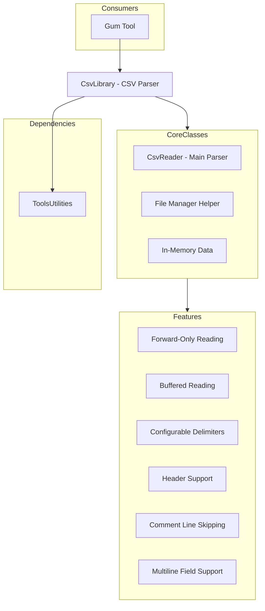

# CsvLibrary (Parser CSV)

## Descripción

CsvLibrary es una librería de parsing CSV (Comma Separated Values) rápida y eficiente, diseñada para herramientas de desarrollo de juegos. Está basada en el CsvReader de Sébastien Lorion con modificaciones para el ecosistema Gum.

Proporciona parsing forward-only de alto rendimiento para archivos CSV sin cargar todo el archivo en memoria.

## Diagrama de Relaciones



## Tecnología

| Aspecto | Valor |
|---------|-------|
| **Framework** | net8.0-windows |
| **Lenguaje** | C# 12.0 |
| **Dependencias** | ToolsUtilities |
| **Licencia** | MIT (basado en Sébastien Lorion) |

## Clases Principales

### CsvReader

| Propiedad/Método | Propósito |
|------------------|-----------|
| `Read()` | Lee siguiente registro |
| `FieldCount` | Número de campos |
| `this[int]` | Accede a campo por índice |
| `this[string]` | Accede a campo por nombre (con headers) |
| `SkipRecord()` | Saltea registro actual |

### Configuración

| Propiedad | Propósito |
|-----------|-----------|
| `Delimiter` | Carácter delimitador (default: ,) |
| `Quote` | Carácter de quote (default: ") |
| `Escape` | Carácter de escape (default: \) |
| `HasHeaders` | Si primera fila son headers |
| `SkipEmptyLines` | Saltar líneas vacías |

### CsvFileManager

| Método | Propósito |
|--------|-----------|
| `LoadCsv()` | Carga CSV desde archivo |
| `LoadEmbeddedCsv()` | Carga desde recurso embebido |
| `ParseCsvFromString()` | Parsea desde string |

### RuntimeCsvRepresentation

| Propiedad | Propósito |
|-----------|-----------|
| `Headers` | Lista de headers |
| `Records` | Lista de registros (arrays de strings) |

## Cómo Ampliar

### Leer CSV con Headers

```csharp
using CsvLibrary;

var reader = new CsvReader("data.csv");
reader.HasHeaders = true;

while (reader.Read())
{
    var name = reader["Name"];
    var age = reader["Age"];
    // ...
}
reader.Dispose();
```

### CSV con Delimiters Custom

```csharp
var reader = new CsvReader("data.tsv");
reader.Delimiter = '\t';  // Tab-separated
reader.HasHeaders = true;

while (reader.Read())
{
    for (int i =0; i < reader.FieldCount; i++)
    {
        Console.WriteLine(reader[i]);
    }
}
```

### Cargar a RuntimeCsvRepresentation

```csharp
var data = CsvFileManager.LoadCsv("data.csv");
foreach (var record in data.Records)
{
    var name = record[0];
    var value = record[1];
}
```

### Manejo de Errores

```csharp
reader.ParseError += (sender, args) =>
{
    Console.WriteLine($"Error at line {args.LineNumber}: {args.Message}");
    args.Action = ParseErrorAction.Continue; // Saltar línea problem
};
```

### Skip Comments

```csharp
var reader = new CsvReader("data.csv");
reader.CommentCharacter = '/';  // Líneas que empiezan con /
//reader.SkipComments = true;  // (si hay propiedad)

while (reader.Read())
{
    // Comments are automatically skipped
}
```

## Retos al Ampliar

### Encoding
- Asume UTF-8 por defecto
- Archivos legacy pueden tener encoding diferente
- **Recomendación**: Especificar encoding en constructor

### Large Files
- Forward-only, no random access
- No hay seekback
- **Recomendación**: Usar streaming para archivos gigantes

### Quoted Fields with Newlines
- CsvReader soporta campos multiline
- Pero puede causar problemas con parsing simple
- **Recomendación**: Validar archivos con campos multiline

### Type Conversion
- Todo se lee como string
- Conversión a tipos requiere manejo manual
- **Recomendación**: Crear helpers de conversión

## Uso Típico en Gum

```csharp
// Cargar archivo de localización
public void LoadLocalization(string csvPath)
{
    var data = CsvFileManager.LoadCsv(csvPath);
    
    foreach (var record in data.Records)
    {
        var key = record[0];
        var english = record[1];
        var spanish = record[2];
        
        // Add to localization dictionary
        LocalizationService.AddEntry(key, "en", english);
        LocalizationService.AddEntry(key, "es", spanish);
    }
}

// Cargar datos de juego desde CSV
public List<EnemyData> LoadEnemies(string path)
{
    var enemies = new List<EnemyData>();
    var reader = new CsvReader(path);
    reader.HasHeaders = true;
    
    while (reader.Read())
    {
        enemies.Add(new EnemyData
        {
            Name = reader["Name"],
            Health = int.Parse(reader["Health"]),
            Damage = float.Parse(reader["Damage"])
        });
    }
    
    return enemies;
}
```

## Formato CSV Soportado

```csv
Name,Age,City
John,30,"New York"
Jane,25,"Los Angeles"
Bob,"35, Jr.",Chicago
"Multi
Line",40,"Seattle"
```

### Características Soportadas

| Característica | Soporte |
|---------------|---------|
| Delimiter custom | Sí |
| Quote fields | Sí |
| Escaped quotes | Sí(\") |
| Multiline fields | Sí |
| Comment lines | Sí |
| Headers | Sí |
| Empty fields | Sí |
| Whitespace handling | Configurable |