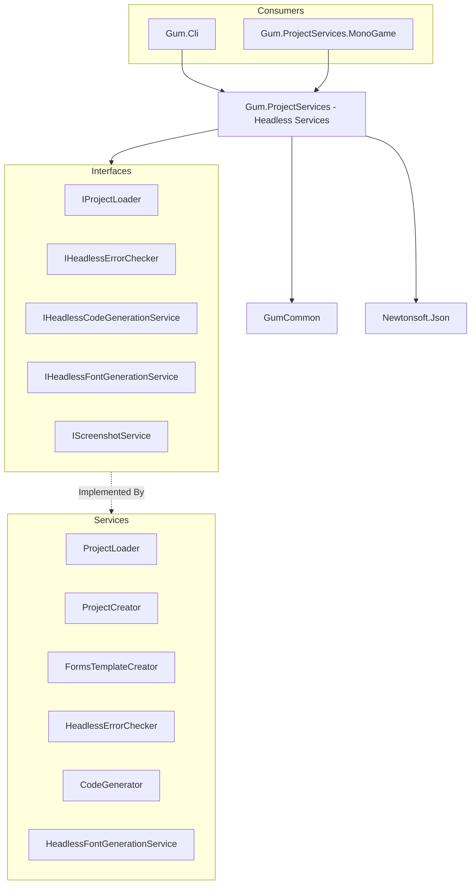

# Gum.ProjectServices (Servicios Headless)

## Descripción

Gum.ProjectServices es una librería que proporciona servicios de negocio sin dependencias de UI (headless) para trabajar con proyectos Gum. Permite cargar proyectos, validar errores, generar código C#, generar fuentes bitmap, y tomar screenshots, todo sin necesidad de la interfaz gráfica del editor Gum.

Es utilizada por la herramienta CLI `gumcli` y puede ser integrada en pipelines de build automatizados.

## Diagrama de Relaciones



## Tecnología

| Aspecto | Valor |
|---------|-------|
| **Framework** | .NET 8.0 |
| **Lenguaje** | C# 12.0 |
| **Dependencias** | GumCommon, Newtonsoft.Json |
| **Recursos Embebidos** | Templates, bmfont.exe |

## Servicios Principales

### ProjectLoader

| Método | Propósito |
|--------|-----------|
| `Load(string filePath)` | Carga un proyecto .gumx |
| `LoadFromContent(string content)` | Carga desde string XML |

### ProjectCreator

| Método | Propósito |
|--------|-----------|
| `CreateProject(string path)` | Crea proyecto vacío |
| `CreateFromTemplate(string path, TemplateType type)` | Crea desde template |

### FormsTemplateCreator

| Método | Propósito |
|--------|-----------|
| `CreateFormsProject(string path)` | Crea proyecto con Forms UI |

### HeadlessErrorChecker

| Método | Propósito |
|--------|-----------|
| `GetAllErrors(GumProjectSave)` | Obtiene todos los errores de validación |
| `ValidateBehaviors(GumProjectSave)` | Valida behaviors |
| `ValidateReferences(GumProjectSave)` | Valida referencias |

### HeadlessCodeGenerationService

| Método | Propósito |
|--------|-----------|
| `GenerateCodeForElement(GumProjectSave, string elementName)` | Genera código para un elemento |
| `GenerateAllCode(GumProjectSave)` | Genera todo el código |

### HeadlessFontGenerationService

| Método | Propósito |
|--------|-----------|
| `CreateAllMissingFontFiles(GumProjectSave)` | Genera fuentes faltantes |
| `GenerateFont(FontSave)` | Genera una fuente específica |

## Cómo Ampliar

### Cargar Proyecto

```csharp
using Gum.ProjectServices;

var loader = new ProjectLoader();
var project = loader.Load("MyProject.gumx");

if (project == null)
{
    Console.WriteLine("Failed to load project");
    return;
}

Console.WriteLine($"Loaded project with {project.Screens.Count} screens");
```

### Validar Proyecto

```csharp
using Gum.ProjectServices;

var project = loader.Load("MyProject.gumx");
var errorChecker = new HeadlessErrorChecker();

var errors = errorChecker.GetAllErrors(project);

if (errors.Count == 0)
{
    Console.WriteLine("No errors found!");
}
else
{
    foreach (var error in errors)
    {
        Console.WriteLine($"Error: {error.Message} in {error.ElementName}");
    }
}
```

### Generar Código

```csharp
using Gum.ProjectServices;

var codeGen = new HeadlessCodeGenerationService();
var project = loader.Load("MyProject.gumx");

// Configurar output
codeGen.OutputDirectory = "./Generated";
codeGen.Namespace = "MyGame.UI";

// Generar código para todos los elementos
codeGen.GenerateAllCode(project);

// O generar para un elemento específico
codeGen.GenerateCodeForElement(project, "MainMenu");
```

### Crear Proyecto desde Template

```csharp
using Gum.ProjectServices;

// Crear proyecto vacío
var creator = new ProjectCreator();
creator.CreateProject("./MyNewProject");

// Crear proyecto con Forms
var formsCreator = new FormsTemplateCreator();
formsCreator.CreateFormsProject("./MyFormsProject");

//Esto crea:
// - MyFormsProject.gumx
// - Screens/DemoScreen.gusx
// - Components/Button.gucx
// - Standards/Text.gutx
// - ... otros estándares Forms
```

### Generar Fuentes

```csharp
using Gum.ProjectServices;

var fontGen = new HeadlessFontGenerationService();

// Requiere Windows (bmfont.exe)
if (!RuntimeInformation.IsOSPlatform(OSPlatform.Windows))
{
    Console.WriteLine("Font generation only works on Windows");
    return;
}

fontGen.CreateAllMissingFontFiles(project);
```

## Retos al Ampliar

### Dependencia de Windows para Fuentes
- `bmfont.exe` solo funciona en Windows
- Generación de fuentes falla en Linux/macOS
- **Recomendación**: Pre-generar fuentes en CI Windows o usar alternativas

### No UI Dependencies
- No puede usar WPF/WinForms types
- Validación de errores es limitada vs editor completo
- **Recomendación**: Complementar con validación manual si es necesario

### Code Generation Complexity
- Código generado puede ser grande
- Maintain mode vs full regeneration
- **Recomendación**: Usar partial classes para código custom

### Screenshot Service
- Requiere backend de rendering (MonoGame, Skia, etc.)
- Implementado en `Gum.ProjectServices.MonoGame`
- **Recomendación**: Usar el proyecto específico para la plataforma

## Uso en CI/CD

```yaml
# GitHub Actions example
- name: Check for Gum Errors
  run: |
    dotnet tool install -g Gum.Cli
    gumcli check MyProject.gumx --json > errors.json
    
- name: Generate Code
  run: |
    gumcli codegen MyProject.gumx --output ./Generated
    
- name: Generate Fonts
  if: runner.os == 'Windows'
  run: |
    gumcli fonts MyProject.gumx
```

## Interfaces Principales

```csharp
// Dependency Injection setup
services.AddSingleton<IProjectLoader,ProjectLoader>();
services.AddSingleton<IHeadlessErrorChecker, HeadlessErrorChecker>();
services.AddSingleton<IHeadlessCodeGenerationService, HeadlessCodeGenerationService>();
services.AddSingleton<IHeadlessFontGenerationService, HeadlessFontGenerationService>();

// Uso con DI
public class MyBuildService
{
    private readonly IProjectLoader _loader;
    private readonly IHeadlessErrorChecker _errorChecker;
    
    public MyBuildService(
        IProjectLoader loader,
        IHeadlessErrorChecker errorChecker)
    {
        _loader = loader;
        _errorChecker = errorChecker;
    }
    
    public ValidationResult Validate(string gumxPath)
    {
        var project = _loader.Load(gumxPath);
        var errors = _errorChecker.GetAllErrors(project);
        return new ValidationResult { Errors = errors };
    }
}
```