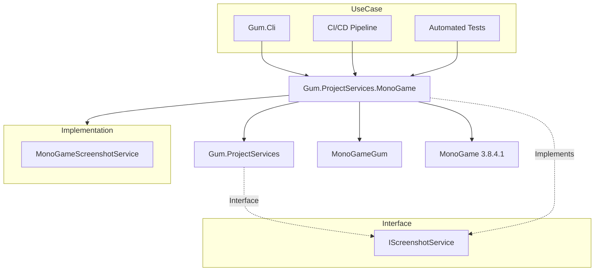

# Gum.ProjectServices.MonoGame (Screenshots MonoGame)

## Descripción

Gum.ProjectServices.MonoGame es una implementación específica de `IScreenshotService` que usa MonoGame para renderizar elementos de Gum a imágenes PNG. Permite generar previews de pantallas y componentes en pipelines automatizados.

**Importante**: Este servicio debe usarse en un proceso separado o con `AssemblyLoadContext` para evitar conflictos de estado estático con otros backends.

## Diagrama de Relaciones



## Tecnología

| Aspecto | Valor |
|---------|-------|
| **Framework** | MonoGame.Framework.DesktopGL 3.8.4.1 |
| **.NET** | net8.0 |
| **Lenguaje** | C# 12.0 |
| **Dependencias** | Gum.ProjectServices, MonoGameGum |

## Clase Principal

### MonoGameScreenshotService

Implementa `IScreenshotService`:

| Método | Parámetros | Retorno |
|--------|-----------|---------|
| `TakeScreenshot()` | `ScreenshotRequest` | `byte[]` (PNG) |

### ScreenshotRequest

| Propiedad | Tipo | Propósito |
|-----------|------|-----------|
| `ElementName` | string | Nombre del elemento a renderizar |
| `Width` | int | Ancho en píxeles |
| `Height` | int | Alto en píxeles |
| `ProjectPath` | string | Ruta al proyecto .gumx |
| `OutputPath` | string | Ruta del PNG de salida |

## Cómo Ampliar

### Tomar Screenshot

```csharp
using Gum.ProjectServices;
using Gum.ProjectServices.MonoGame;

var screenshotService = new MonoGameScreenshotService();

var request = new ScreenshotRequest
{
    ElementName = "MainMenu",
    Width = 1920,
    Height = 1080,
    ProjectPath = "MyProject.gumx",
    OutputPath = "MainMenu.png"
};

var pngBytes = screenshotService.TakeScreenshot(request);

// O guardar directamente a archivo
File.WriteAllBytes("MainMenu.png", pngBytes);
```

### Usar con DI

```csharp
// Registrar en startup
services.AddSingleton<IScreenshotService, MonoGameScreenshotService>();

// Usar en servicio
public class PreviewGenerator
{
    private readonly IScreenshotService _screenshotService;
    private readonly IProjectLoader _projectLoader;
    
    public PreviewGenerator(
        IScreenshotService screenshotService,
        IProjectLoader projectLoader)
    {
        _screenshotService = screenshotService;
        _projectLoader = projectLoader;
    }
    
    public void GeneratePreviews(string gumxPath)
    {
        var project = _projectLoader.Load(gumxPath);
        
        foreach (var screen in project.Screens)
        {
            var request = new ScreenshotRequest
            {
                ElementName = screen.Name,
                Width = 1280,
                Height = 720,
                ProjectPath = gumxPath,
                OutputPath = $"Previews/{screen.Name}.png"
            };
            
            _screenshotService.TakeScreenshot(request);
        }
    }
}
```

### CI/CD Integration

```bash
# CLI usage
gumcli screenshot MyProject.gumx MainMenu --output MainMenu.png --width 1920 --height 1080

# Batch generation
for screen in Screen1 Screen2 Screen3; do
    gumcli screenshot MyProject.gumx $screen --output "previews/${screen}.png"
done
```

## Retos al Ampliar

### Game Loop Requirement
- MonoGame requiere un `Game` instance
- `MonoGameScreenshotService` crea un `Game` interno
- **Recomendación**: No mezclar con otros Game instances

### Static State Conflicts
- MonoGame tiene estado estático global
- Múltiples backends pueden causar conflictos
- **Recomendación**: Usar `AssemblyLoadContext` para aislamiento

```csharp
// Patrón recomendado para múltiples backends
public class ScreenshotLoader : AssemblyLoadContext
{
    public byte[] TakeScreenshot(ScreenshotRequest request)
    {
        var assembly = LoadFromAssemblyPath("Gum.ProjectServices.MonoGame.dll");
        var serviceType = assembly.GetType("Gum.ProjectServices.MonoGame.MonoGameScreenshotService");
        var service = Activator.CreateInstance(serviceType);
        // ...
    }
}
```

### Windows Dependency
- MonoGame DesktopGL funciona mejor en Windows
- Linux/macOS pueden tener problemas de renderizado
- **Recomendación**: Ejecutar screenshots en runners Windows CI

### Performance
- Crear Game instance es costoso
- Múltiples screenshots: reusar instancia
- **Recomendación**: Batch screenshots en una sesión

## Nuevo Backend Implementation

Para crear un backend de screenshot diferente (ej. Skia):

```csharp
// Gum.ProjectServices.Skia
public class SkiaScreenshotService : IScreenshotService
{
    public byte[] TakeScreenshot(ScreenshotRequest request)
    {
        // Usar SkiaSharp para renderizar
        using var surface = SKSurface.Create(new SKImageInfo(request.Width, request.Height));
        using var canvas = surface.Canvas;
        
        // Cargar proyecto Gum
        var gumService = new GumService();
        gumService.Initialize(canvas);
        
        // Cargar elemento
        var element = LoadElement(request.ElementName, request.ProjectPath);
        element.Render(canvas);
        
        // Capturar
        using var image = surface.Snapshot();
        using var data = image.Encode(SKEncodedImageFormat.Png, 100);
        
        return data.ToArray();
    }
}
```

## Comparación de Backends

| Backend | Plataforma | Performance | Características |
|---------|-----------|-------------|-----------------|
| MonoGameScreenshotService | Windows/Linux/macOS | Media | Game-accurate rendering |
| SkiaScreenshotService | Cross-platform | Alta | Vector graphics, sin Game |
| RaylibScreenshotService | Windows/Linux/macOS | Media | Simple API |