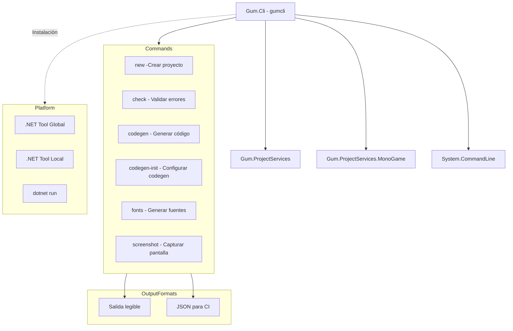

# Gum.Cli (Herramienta de Línea de Comandos)

## Descripción

Gum.Cli (`gumcli`) es una herramienta de línea de comandos para trabajar con proyectos Gum sin la interfaz gráfica del editor. Permite crear proyectos, validar errores, generar código, generar fuentes y tomar screenshots, todo desde la terminal o scripts de CI/CD.

Está empaquetada como .NET Tool para facilitar su instalación y uso.

## Diagrama de Relaciones



## Tecnología

| Aspecto | Valor |
|---------|-------|
| **Framework** | .NET 8.0 |
| **Lenguaje** | C# 12.0 |
| **Output** | Exe (Consola) |
| **Package** | .NET Tool (`<PackAsTool>true`) |
| **CLI Framework** | System.CommandLine 2.0 |

## Comandos Disponibles

### gumcli new

Crea un nuevo proyecto Gum.

```bash
# Sintaxis
gumcli new <PATH> [--template <TEMPLATE>]

# Ejemplos
gumcli new MyProject
gumcli new MyProject --template forms
gumcli new MyProject --template empty

# Templates disponibles:
# - forms: Proyecto con UI components pre-creados
# - empty: Proyecto vacío
```

### gumcli check

Valida un proyecto buscando errores.

```bash
# Sintaxis
gumcli check <PROJECT> [--json]

# Ejemplos
gumcli check MyProject.gumx
gumcli check MyProject.gumx --json > errors.json

# Salida JSON ejemplo:
# {
#   "errors": [
#     {
#       "message": "Element 'Button' references non-existent base 'CustomButton'",
#       "fileName": "Components/Button.gucx",
#       "lineNumber": 5
#     }
#   ],
#   "success": false
# }
```

### gumcli codegen

Genera código C# desde elementos Gum.

```bash
# Sintaxis
gumcli codegen <PROJECT> [--element <NAME>] [--output <DIR>]

# Ejemplos
# Generar todo
gumcli codegen MyProject.gumx

# Generar solo un elemento
gumcli codegen MyProject.gumx --element MainMenu

# Especificar directorio de salida
gumcli codegen MyProject.gumx --output ./Generated/UI

# Generar para runtime específico
gumcli codegen MyProject.gumx --runtime MonoGame
```

### gumcli codegen-init

Configura automáticamente la generación de código detectando el .csproj más cercano.

```bash
# Sintaxis
gumcli codegen-init <PROJECT> [--force] [--csproj <PATH>]

# Ejemplos
gumcli codegen-init MyProject.gumx
gumcli codegen-init MyProject.gumx --force
gumcli codegen-init MyProject.gumx --csproj MyGame.csproj
```

### gumcli fonts

Genera fuentes bitmap faltantes.

```bash
# Sintaxis
gumcli fonts <PROJECT>

# Ejemplos
gumcli fonts MyProject.gumx

# Nota: Solo funciona en Windows (requiere bmfont.exe)
```

### gumcli screenshot

Renderiza un elemento a imagen PNG.

```bash
# Sintaxis
gumcli screenshot <PROJECT> <ELEMENT> [--output <PATH>] [--width <N>] [--height <N>]

# Ejemplos
gumcli screenshot MyProject.gumx MainMenu
gumcli screenshot MyProject.gumx MainMenu --output MainMenu.png
gumcli screenshot MyProject.gumx MainMenu --width 1920 --height 1080
```

## Instalación

### Como .NET Tool Global

```bash
# Instalar
dotnet tool install -g Gum.Cli

# Actualizar
dotnet tool update -g Gum.Cli

# Desinstalar
dotnet tool uninstall -g Gum.Cli
```

### Como .NET Tool Local

```bash
# Crear manifiesto
dotnet new tool-manifest

# Instalar local
dotnet tool install Gum.Cli

# Usar
dotnet gumcli check MyProject.gumx
```

### Desde Source

```bash
cd Gum_new/Tools/Gum.Cli
dotnet run -- check ../../MyProject.gumx
```

## Cómo Ampliar

### Añadir Nuevo Comando

```csharp
// Commands/NewMyCommand.cs
public static class MyCommand
{
    public static Command Create()
    {
        var command = new Command("mycommand", "Does something useful");
        
        var projectArgument = new Argument<string>("project")
        {
            Description = "Path to .gumx file"
        };
        
        var optionArgument = new Option<string>("--option")
        {
            Description = "Some option"
        };
        
        command.AddArgument(projectArgument);
        command.AddOption(optionArgument);
        
        command.SetHandler((project, option) =>
        {
            Execute(project, option);
        }, projectArgument, optionArgument);
        
        return command;
    }
    
    private static void Execute(string project, string option)
    {
        // Implementar lógica
        Console.WriteLine($"Processing {project} with {option}");
    }
}

// En Program.cs
rootCommand.AddCommand(MyCommand.Create());
```

### Formato de Salida JSON

```csharp
// Agregar soporte JSON a un comando existente
var jsonOption = new Option<bool>("--json")
{
    Description = "Output as JSON"
};

command.SetHandler((project, json) =>
{
    var errors = CheckProject(project);
    
    if (json)
    {
        var output = JsonSerializer.Serialize(new
        {
            errors = errors.Select(e => new
            {
                message = e.Message,
                fileName = e.FileName,
                lineNumber = e.LineNumber
            }),
            success = errors.Count == 0
        });
        Console.WriteLine(output);
    }
    else
    {
        foreach (var error in errors)
        {
            Console.WriteLine($"Error: {error.Message} in {error.FileName}:{error.LineNumber}");
        }
    }
}, projectArgument, jsonOption);
```

## Integración CI/CD

### GitHub Actions

```yaml
name: Gum Validation

on: [push, pull_request]

jobs:
  validate:
    runs-on: windows-latest
    steps:
      - uses: actions/checkout@v3
      
      - name: Setup .NET
        uses: actions/setup-dotnet@v3
        with:
          dotnet-version: '8.0.x'
      
      - name: Install gumcli
        run: dotnet tool install -g Gum.Cli
      
      - name: Check for errors
        run: gumcli check MyProject.gumx --json > errors.json
      
      - name: Generate code
        run: gumcli codegen MyProject.gumx --output ./Generated
      
      - name: Upload generated code
        uses: actions/upload-artifact@v3
        with:
          name: generated-code
          path: ./Generated
```

### Azure Pipelines

```yaml
# azure-pipelines.yml
trigger:
- main

pool:
  vmImage: 'windows-latest'

steps:
- task: UseDotNet@2
  inputs:
    packageType: 'sdk'
    version: '8.0.x'
    
- script: dotnet tool install -g Gum.Cli
  displayName: 'Install gumcli'

- script: gumcli check $(Build.SourcesDirectory)/MyProject.gumx
  displayName: 'Validate Gum project'

- script: gumcli codegen $(Build.SourcesDirectory)/MyProject.gumx --output $(Build.SourcesDirectory)/Generated
  displayName: 'Generate UI code'
```

## Retos al Ampliar

### Cross-Platform Paths
- rutas con espacios requieren quotes
- Separadores de directorio diferentes
- **Recomendación**: Usar `Path.Combine()` y `Path.DirectorySeparatorChar`

### Error Reporting
- precisar distinction entre errores y warnings
- códigos de salida para CI
- **Recomendación**: Usar exit codes y `--json` para parsing

### Large Projects
- proyectos grandes pueden tardar
- no hay progress reporting
- **Recomendación**: Añadir `--verbose` mode

### Dependency Management
- algunos comandos necesitan MonoGame
- otros solo necesitan Gum.ProjectServices
- **Recomendación**: Lazy load de dependencias