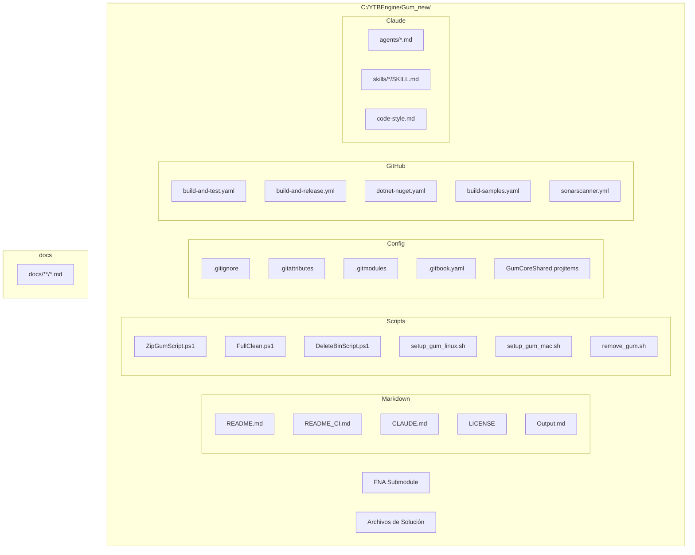

# Archivos Sueltos y Scripts

## Descripción

Este documento describe los archivos en el repositorio Gum que no forman parte de ningún proyecto `.csproj`, incluyendo scripts de build, documentación, configuración y otros archivos de soporte.

## Diagrama de Ubicaciones



## Archivos de Documentación

### README.md
- **Ubicación**: Raíz
- **Propósito**: Documentación principal del proyecto
- **Contenido**: Descripción del proyecto, badges, enlaces a tutoriales

### README_CI.md
- **Ubicación**: Raíz
- **Propósito**: Documentación del workflow de CI
- **Contenido**: Cómo se descubren y compilan las soluciones automáticamente

### CLAUDE.md
- **Ubicación**: Raíz
- **Propósito**: Guías para el asistente de IA Claude
- **Contenido**: Workflow de agentes (coder, qa, docs-writer), referencia a code-style

### LICENSE
- **Ubicación**: Raíz
- **Propósito**: Licencia MIT
- **Contenido**: Copyright FlatRedBall, LLC, términos de licencia

### docs/ (GitBook)
- **Ubicación**: `docs/`
- **Propósito**: Documentación completa del usuario
- **Contenido**: Tutoriales, referencia de API, guías de migración

## Scripts de PowerShell

### ZipGumScript.ps1
```powershell
# Propósito: Crear Gum.zip para distribución
# Uso: ./ZipGumScript.ps1
# Output: Gum.zip en directorio de build
# Usa: TeamCity CI para releases
```

### FullClean.ps1
```powershell
# Propósito: Limpiar todas las carpetas bin/obj
# Uso: ./FullClean.ps1
# Elimina recursivamente:
#   - bin/
#   - obj/
#   - .vs/
```

### DeleteBinScript.ps1
```powershell
# Propósito: Eliminar carpetas bin específicas
# Uso: ./DeleteBinScript.ps1
# Limpieza rápida de proyectos principales
```

## Scripts de Shell (Linux/macOS)

### setup_gum_linux.sh
```bash
# Propósito: Instalar Gum en Linux via Wine
# Compatibilidad: Ubuntu, Linux Mint, Fedora, Nobara
# Instala:
#   - Wine 10+
#   - winetricks
#   - .NET 8 runtime
#   - Fonts
#   - Descarga Gum.zip
#   - Crea ~/bin/gum launcher
# Uso: ./setup_gum_linux.sh
```

### setup_gum_mac.sh
```bash
# Propósito: Instalar Gum en macOS via Wine
# Compatibilidad: Intel Mac, Apple Silicon (via Rosetta)
# Instala:
#   - Wine via Homebrew
#   - MoltenVK (Vulkan support)
#   - .NET 8 runtime
#   - Crea launcher
# Uso: ./setup_gum_mac.sh
```

### remove_gum.sh
```bash
# Propósito: Desinstalar Gum de Linux/macOS
# Elimina:
#   - Wine prefix
#   - Launcher script
#   - wine/winetricks (opcional)
#   - Limpia PATH
# Uso: ./remove_gum.sh
```

## GitHub Actions Workflows

### build-and-test.yaml
```yaml
# Propósito: CI principal
# Trigger: PR, push
# Jobs:
#   - build-windows: Build solution on Windows
#   - build-macos: Build solution on macOS
#   - test: Run unit tests
```

### build-and-release.yml
```yaml
# Propósito: Release manual
# Trigger: manual dispatch
# Jobs:
#   - build-gum: Build Gum.exe
#   - package: Create Gum.zip
#   - release: Create GitHub release
#   - version-bump: PR for version bump
```

### dotnet-nuget.yaml
```yaml
# Propósito: Publicar paquetes NuGet
# Trigger: manual dispatch
# Jobs:
#   - pack: Create .nupkg
#   - push-nuget: Push to nuget.org
#   - push-github: Push to GitHub Packages
```

### build-samples.yaml
```yaml
# Propósito: Compilar proyectos de ejemplo
# Trigger: manual dispatch
# Jobs:
#   - build-all: Compila todos los Samples/
```

### sonarscanner.yml
```yaml
# Propósito: Análisis de código SonarQube
# Trigger: push to master
# Jobs:
#   - analyze: Run SonarScanner
#   - coverage: Collect test coverage
```

## Configuración Git

### .gitignore
```
# Patrones ignorados:
#   - bin/, obj/
#   - .vs/
#   - *.user, *.suo
#   - packages/
#   - generated JSON files
```

### .gitattributes
```
# Líneas normalizadas a LF
# *.sh text eol=lf
# Diff de C#
# *.cs diff=csharp
```

### .gitmodules
```
# Submódulos:
#   - fna: FNA library (git@github.com:FNA-XNA/FNA.git)
```

### .gitbook.yaml
```yaml
# Configuración de GitBook
# root: ./docs
```

## Archivos de Solution

### Gum.sln
- **Propósito**: Solution principal para el editor Gum y librerías core
- **Proyectos**: ~25 proyectos

### AllLibraries.sln
- **Propósito**: Solution con todos los proyectos para NuGet packaging
- **Proyectos**: ~50+ proyectos

### SkiaGum.sln
- **Propósito**: Solution para proyectos SkiaSharp
- **Proyectos**: SkiaGum y dependencias

## Archivos del Submódulo FNA

### fna/Directory.Build.props
```xml
# Propósito: Propiedades MSBuild para FNA
# Configura compilation para FNA submodule
```

### fna/.editorconfig
```
# Propósito: Configuración de editor para FNA
# Estilos de código para contribuir a FNA
```

## Configuración Claude AI (.claude/)

### agents/
```
coder.md:         Agente de codificación
qa.md:            Agente de testing
docs-writer.md:   Agente de documentación
product-manager.md: Agente de gestión
refactoring-specialist.md: Agente de refactoring
security-auditor.md: Agente de seguridad
```

### skills/
```
gum-unit-tests/:     Testing unitario
gum-tool-viewmodels/: ViewModels del editor
gum-runtime-binding/: Runtime bindings
gum-tool-codegen/:   Code generation
gum-forms-controls/: Forms controls
...
```

### code-style.md
```
# Reglas de estilo de código:
# - Nullable parameters
# - Interfaces para servicios
# - Patrones de testing
# - Documentación XML
```

## Archivos de Proyecto Compartido

### GumCoreShared.projitems
```xml
# Propósito: Definir archivos compartidos entre proyectos GumCore
# ~133 archivos compilados
# Comparte código entre plataformas (iOS, Android, DesktopGL, etc.)
```

### GumCoreShared.shproj
```xml
# Propósito: Definición de proyecto compartido de Visual Studio
# Referenciado por todos los proyectos GumCore
```

## Uso Común de Scripts

```bash
# Limpiar todo
./FullClean.ps1

# Crear release
./ZipGumScript.ps1

# Instalar en Linux
./setup_gum_linux.sh

# Instalar en macOS
./setup_gum_mac.sh

# Desinstalar
./remove_gum.sh
```

## Notas Importantes

1. **Scripts de PowerShell** solo funcionan en Windows
2. **Scripts de Shell** requieren permisos de ejecución (`chmod +x`)
3. **Submódulo FNA** requiere `git submodule update --init --recursive`
4. **Archivos .projitems** son autogenerados, no editar manualmente
5. **Workflows de GitHub** pueden necesitar secrets configurados